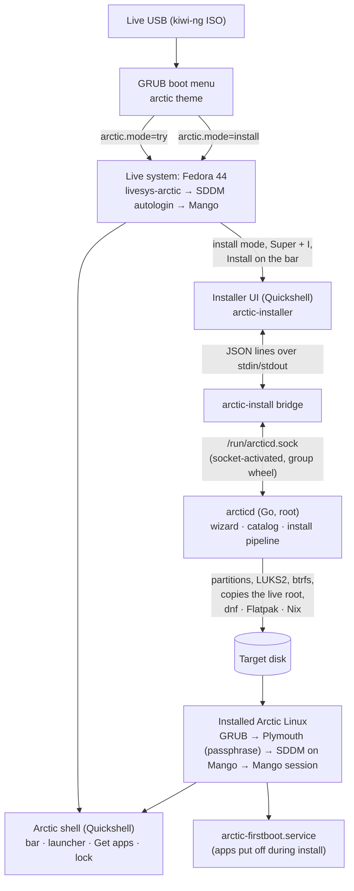
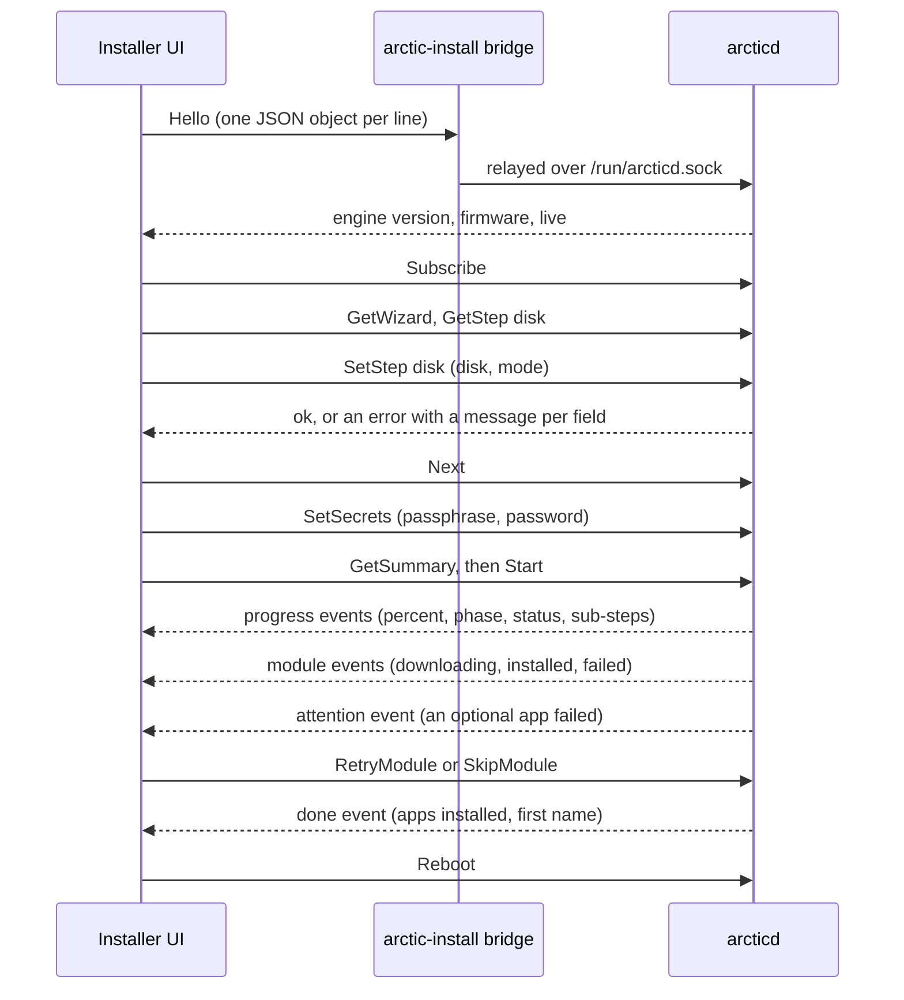

# Architecture

How the pieces of Arctic Linux fit together: the live USB, the installer (a Go engine and a
Quickshell UI), the desktop shell, the packages and the ISO. The contracts between components are
fixed in [`docs/BUILD-SPEC.md`](https://github.com/yuvalkolodkingal/O-Tism/blob/main/docs/BUILD-SPEC.md);
the reasons behind them are in [`docs/PLAN.md`](https://github.com/yuvalkolodkingal/O-Tism/blob/main/docs/PLAN.md).

## The big picture

## Repository layout

| Path | What |
|---|---|
| `cmd/arcticd/`, `cmd/arctic-install/` | The installer engine daemon and its command-line client |
| `internal/` | Engine packages (Go, standard library only) |
| `modules/`, `profiles/` | The app catalog and unattended install profiles |
| `installer-ui/` | The installer wizard (Quickshell / QML) |
| `shell/` | The desktop shell (Quickshell / QML, Python helpers) |
| `dotfiles/` | The home directory defaults (`/etc/skel`) and the `arctic-*` commands |
| `live/` | Live session files |
| `branding/` | SDDM theme, GRUB theme, Plymouth theme, logos, fonts |
| `design/` | The design system sources: tokens, brand book, exports, fonts, logos, wallpapers |
| `packaging/` | RPM specs and the system files they install |
| `iso/kiwi/` | The kiwi-ng description of the live ISO |
| `tools/` | Build and VM test scripts |

## The live session

1. **GRUB** (`iso/kiwi/grub-arctic.cfg.iso-template`, arctic theme) boots the kernel with
   `rd.live.image` and `arctic.mode=try` or `arctic.mode=install`.
2. **livesys** (Fedora's `livesys-scripts`) creates `liveuser` and runs
   `/usr/libexec/livesys/sessions.d/livesys-arctic` (package `arctic-live`), which:
   - writes the mode to `/run/arctic/live-mode`;
   - sets SDDM to log `liveuser` straight into `mango.desktop` (unless `arctic.greeter=1`);
   - adds `/usr/share/arctic/mango/live.conf` to liveuser's Mango configuration;
   - turns off screen locking and gives liveuser passwordless `sudo` and polkit.
3. **Mango** starts the normal Arctic autostart (theme, shell, notifications, network applet,
   clipboard, idle) plus, from `live.conf`, `/usr/libexec/arctic/live-session`.
4. `live-session` reads `arctic.mode`. In install mode it runs `arctic-start-installer`, which
   opens the installer full screen (one instance at a time, guarded by a lock file). In try mode it
   does nothing, and `arctic-welcome` asks the shell to show the welcome card once per boot.

`arctic-is-live` (true when `rd.live.image` is on the kernel command line) is how every helper
knows it's on the live USB: no lock screen, a smaller power menu, the Install item on the bar.

## The installer

The installer is split in two so that the part that needs root never draws anything, and the
part that draws never needs root.

### arcticd, the engine

`arcticd` runs as root, started on demand by `arcticd.socket` (`/run/arcticd.sock`, mode 0660,
group `wheel`, only on the live USB). It owns the whole flow:

| Package | Role |
|---|---|
| `internal/wizard` | The ten steps, their copy, defaults, validation and navigation (Next validates; the network step auto-skips when wired and online; Goto only to finished steps) |
| `internal/catalog` | Loads `modules/*/*/module.toml`: categories, apps, install methods, download sizes |
| `internal/engine` | Holds the wizard, the secrets (in memory only) and the install run; answers requests and sends events |
| `internal/protocol` | The message types |
| `internal/host` | The real machine: disks (`lsblk`, `sfdisk`), Wi-Fi (`nmcli`), time zone (Fedora's GeoIP service), the live keyboard, SaveLog, reboot |
| `internal/installer` | The install pipeline, every command going through a `Runner` (real, dry-run or fake) |
| `internal/mock` | A simulated machine for development: disks, Wi-Fi, a realistic install with one optional-app failure |
| `internal/profile` | Unattended profiles |
| `internal/hw`, `internal/toml`, `internal/backend`, `internal/daemon` | Hardware facts, a small TOML parser, the engine/machine seam, wiring for the binaries |

### The protocol

The UI runs `arctic-install bridge`, which relays newline-delimited JSON between its stdin/stdout
and the socket. `arctic-install bridge --mock` starts an in-process mock engine instead, so the UI
runs without root or a daemon.

Methods: `Hello`, `GetWizard`, `GetStep`, `SetStep`, `Next`, `Back`, `Goto`, `ScanWifi`,
`ConnectWifi`, `NetworkState`, `CheckPassphrase`, `SuggestPassphrase`, `SuggestAccount`,
`SetSecrets`, `EstimateDownload`, `GetSummary`, `Start`, `RetryModule`, `SkipModule`, `SaveLog`,
`Reboot`, `Subscribe`. Events: `progress`, `module`, `attention`, `failed`, `done`, `wizard`. The
full table with parameters is in BUILD-SPEC §4.

Secrets are sent once with `SetSecrets`, kept in memory, never logged, and wiped when the install
finishes. The password is hashed (SHA-512 crypt) before `useradd` sees it.

### installer-ui, the wizard

`installer-ui/` is a thin renderer: a full-screen layer-shell window (namespace
`arctic-installer`, exclusive keyboard) with the rail, header, one page per step and a footer.
`Engine.qml` runs the bridge; `Wizard.qml` keeps the state the engine sends. It follows the design
system's tokens and components (`components/Ar*.qml`). Test and automation hooks are exposed over
Quickshell IPC (target `installer`: `next`, `back`, `goto`, `fill`, `state`, `retry`, `skip`, …).

When the Keyboard step is set, the engine writes the layout to the live system and the UI runs
`/usr/libexec/arctic/live-keyboard`, which reloads Mango, so passwords are typed with the layout
the installed system will check them with.

### The install pipeline

What `arcticd` does after **Start** (`internal/installer`):

1. **Preflight:** re-probe the disks; refuse if the chosen disk is gone, is another device, or
   (alongside) its free space changed.
2. **Disk:** release automounts and swap on the disk; partition (erase: BIOS boot, ESP, `/boot`,
   root; alongside: `/boot` and root in the largest free region, sharing the ESP); `mkfs`; LUKS2
   (argon2id) when encryption is on; btrfs with `@`, `@home`, `@var_log`, `@nix` (zstd:1).
3. **Copy:** `rsync -aAXH` of the live root (`/run/rootfsbase`, else the mounted squashfs) without
   `security.selinux`; the ESP's files are copied separately. Then `dnf remove` of the live-only
   packages (`arctic-live`, `livesys-scripts`, `arctic-installer`, `dracut-live`,
   `dracut-kiwi-live`).
4. **Configure:** machine-id, `systemd-firstboot` (locale, time zone, hostname), keyboard files
   (`/etc/vconsole.conf`, `/etc/arctic/mango/keyboard.conf`, the greeter's copy and the SDDM
   theme's layout), `fstab`, `crypttab`, autologin, services, the live session's Wi-Fi profiles.
5. **Boot loader:** `/etc/default/grub` (arctic theme, os-prober only for alongside),
   `/etc/kernel/cmdline`, `kernel-install`, `grub2-mkconfig`; `efibootmgr` with Fedora's shim on
   UEFI, `grub2-install` on BIOS.
6. **Apps:** remove unticked apps that came with the live image; one `dnf` transaction for the dnf
   and COPR apps (plus the language pack, os-prober for alongside, and RPM Fusion for the codecs);
   Flatpak from the live host into the target with `FLATPAK_*` variables (no chroot); Nix with
   `nix --store /mnt profile add`. An app that fails raises an `attention` event (Try again / Skip);
   unattended installs retry once, then put it off to `/var/lib/arctic/pending.json`.
7. **Finalize:** the user (`useradd --groups wheel`, pre-hashed password), `root` locked,
   `/etc/arctic/default-apps` and `/etc/xdg/mimeapps.list` from the picked apps, the engine log
   copied to `/var/log/arctic-install/`, `setfiles` relabel (else `/.autorelabel`), unmount, close
   LUKS.

A core failure sends a `failed` event (`fatal`, `can_change`): the UI offers Try again, Change your
answers and Save log. Alongside partitions and the firmware boot entry the run created are
removed again.

### The app catalog

Each app is `modules/<category>/<id>/module.toml`: name, summary, category, whether it's a default,
whether it's already in the live image, and an ordered list of install methods
(`dnf`, `copr`, `flatpak`, `nix`) with download sizes, plus `[defaults]` (the role it fills in
`/etc/arctic/default-apps`, its desktop id and the file types it opens). `modules/catalog.toml`
holds the categories, their order and rules (`one` / `any`, required), the pinned nixpkgs revision
and the Flatpak runtime sizes. Hidden, always-installed modules live in `modules/_system/`
(`desktop-base`, `flatpak`, `nix`, `codecs`). Profiles and the UI reference module ids only, never
commands.

## The desktop

- **SDDM** (`sddm-wayland-mango`) runs its Qt 6 greeter on Mango with a minimal configuration
  (`/usr/share/arctic/sddm/greeter.conf`: no key bindings, no autostart), themed by
  `arctic-sddm-theme`.
- **Mango** reads `~/.config/mango/config.conf`, which sources, in order: `arctic/look.conf`, the
  theme's `mango-colors.conf`, `arctic/input.conf`, `/etc/arctic/mango/keyboard.conf`,
  `arctic/apps.conf`, `arctic/binds.conf`, `arctic/rules.conf`, `arctic/autostart.conf`,
  `~/.config/arctic/motion.conf`, then `user.conf`. The `arctic/*.conf` files are links to
  `/usr/share/arctic/mango/`, so package updates reach existing accounts.
- **Autostart:** `arctic-theme apply`, `arctic-session shell|mako|nm-applet|clipboard|idle`,
  `arctic-welcome`.
- **The shell** (`shell/`, run by `arctic-shell` as `quickshell -p /usr/share/arctic/shell`) draws
  the bar, frame, launcher, Get apps, wallpapers, power menu, shortcut sheet, OSD, lock screen
  (ext-session-lock + PAM), polkit agent and live welcome. Workspaces come from `mmsg watch`
  through `scripts/workspaces.py`.
- **Keybinds and helpers talk to the shell over IPC:** `arctic-shell-ipc <target> <function>`
  (`quickshell ipc call`). Targets: `launcher`, `apps`, `wallpapers`, `power`, `keys`, `osd`,
  `lock`, `welcome`, `dnd`, `shell`. It exits non-zero when the shell isn't running, so every
  `arctic-*` helper falls back to fuzzel, swaylock or a notification. `ARCTIC_SHELL=waybar`
  selects the waybar fallback desktop.
- **Themes:** `~/.config/arctic/current` links to `/usr/share/arctic/themes/<theme>`; every app
  reads its colours through it (`theme.json` for the shell, `kitty.conf`, `mako.ini`,
  `mango-colors.conf`, GTK CSS, …). `arctic-theme` switches the link and reloads each component.
- **Default apps:** `arctic-open <role>` reads `/etc/arctic/default-apps` then
  `~/.config/arctic/default-apps`, with a fallback list per role.
- **arctic-firstboot** (in `arctic-desktop-config`, because the installer is removed from the new
  system) runs after `network-online.target` when `/var/lib/arctic/pending.json` exists.

## Packaging and the ISO

- `packaging/arctic-linux.spec` builds every Arctic subpackage from one tarball of the repository
  (see [Building from source](Building-from-Source#build-the-rpms-toolsbuild-rpmssh));
  `packaging/mangowm.spec` builds Mango from upstream. `arctic-desktop` is the metapackage.
- `arctic-release` replaces `fedora-release` (os-release `ID=arctic`, `ID_LIKE=fedora`,
  `%fedora 44`) and keeps Fedora's repositories. It adds the signed Arctic package repository
  on GitHub Pages (the stable channel on, testing off) with its key; every build's Release
  carries its build time, so each build updates the ones before it.
- The ISO is built by kiwi-ng from `iso/kiwi/config.kiwi`, derived from Fedora's own kiwi
  descriptions: hybrid ISO, UEFI (Fedora's signed shim) and BIOS, erofs root, volume id
  `Arctic-Linux-0.2`. `config.sh` sets the live session, enables SDDM, `arcticd.socket` and
  `nix-daemon`, sets the Plymouth theme and removes rescue images to keep the ISO under 2 GiB.
