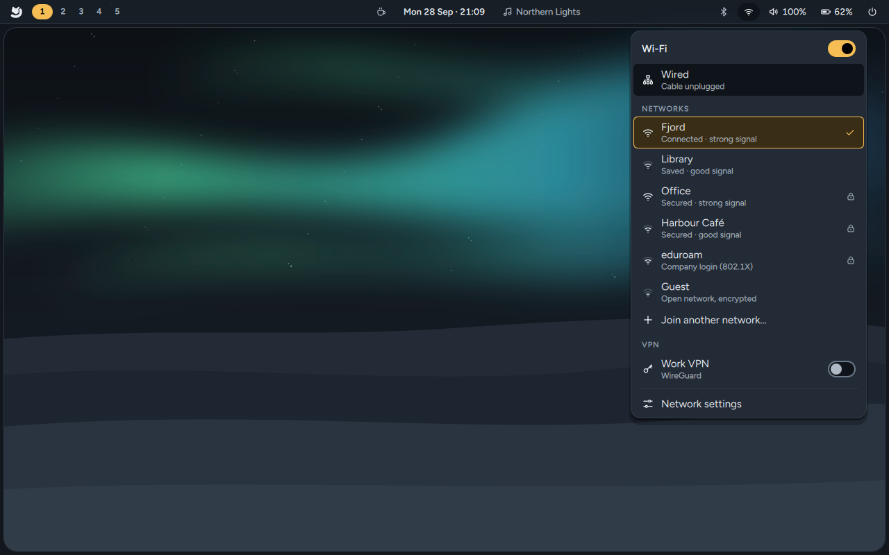
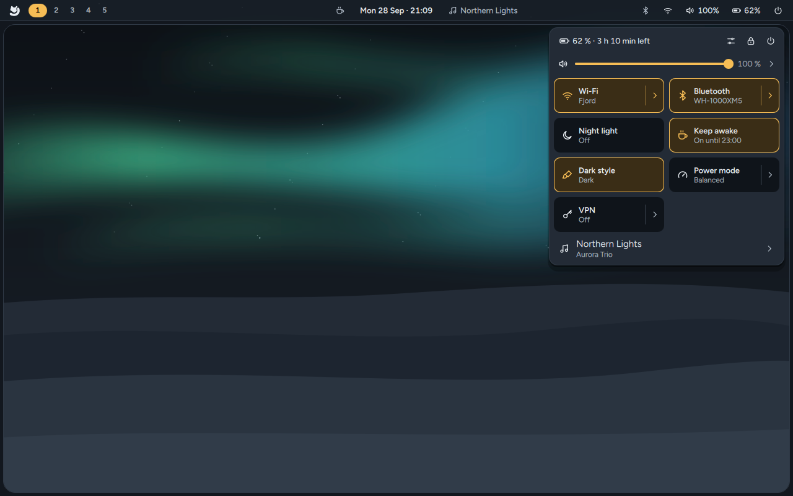

# Menus on the bar and Quick settings

Every item on the top bar opens its own menu, drawn by Arctic in the same style as the rest of
the desktop. One menu is open at a time; click the item again, click outside or press `Esc` to
close it. Each menu also has a shortcut, and `Ctrl + Tab` moves to the menu of the next item on
the bar.

## Network and Wi-Fi (`Super + Ctrl + W`)

- **Wi-Fi** at the top turns Wi-Fi on or off. If a switch on the computer turned it off, the menu
  says so.
- **Wired** shows whether a cable is plugged in and connected.
- **Networks** lists the Wi-Fi networks nearby, strongest first, with the one you're connected to
  at the top. The icon shows the signal; a lock means the network needs a password. Arctic looks
  for networks only while the menu is open.
- Click a network to join it. If it needs a password, the menu asks for it right there. Networks
  you joined before connect without asking.
- **Company and school networks** ("Company login (802.1X)", such as eduroam) open a page for your
  username, the sign-in method (PEAP with MSCHAPv2 is the usual one), the certificate check and
  your password. Signing in with a certificate of your own is set up in **Edit connections…**.
- **Join another network…** is for networks that don't show their name (hidden networks): type
  the name, pick the security and enter the password.
- Right-click a network (or press the Menu key, or `Delete` for forget) for **Disconnect**,
  **Share with a phone…** (a QR code a phone camera joins with; **Show password** if you'd rather
  type it), **Connect automatically** and **Forget this network**.
- **VPN** switches appear when you have VPN or WireGuard connections. Import them in
  **Settings → Network** or with **Edit connections…**.
- **Edit connections…** opens NetworkManager's connection editor for proxies, fixed addresses and
  certificate logins.

Your password goes straight to NetworkManager: it is never put on a command line or in a log.

## Bluetooth (`Super + Ctrl + B`)

- The switch at the top turns Bluetooth on or off (right-clicking the bar icon does too).
- **Your devices**: click one to connect or disconnect it. The `…` button opens its page:
  **Let it connect without asking**, its battery, and **Forget this device**.
- **Pair a new device** makes the computer visible and looks for devices while the page is open.
  Put the device in pairing mode and click it. If it shows a code, Arctic asks you to check it; if
  you need to type a code on a keyboard, Arctic shows which one.
- **More Bluetooth options…** opens the Bluetooth manager (Blueman) for file transfer.

## Sound (`Super + Ctrl + A`)

The volume of your speakers or headphones and of your microphone, where sound plays and which
microphone listens, and a volume slider for each app that is playing. Click the speaker or
microphone icon to mute. `Shift` + the Mute key moves sound to the next output. **Volume
control…** opens the full mixer for device profiles and routing.

## Battery and power mode (`Super + Ctrl + P`)

How much charge is left and how long it lasts, the **power mode** (Power saver, Balanced,
Performance), **Limit charging to 80 %** when your laptop supports a charge limit (the number is
the one your laptop uses), the battery's health and the batteries of your mouse, keyboard or
headphones.

Arctic tells you once when the battery gets low, and again, even with do not disturb on, when it
is about to run out, with what the computer will do then (usually suspend). Turn the first warning
off in **Settings → Power and lock** (it is `batteryWarnings` in `~/.config/arctic/shell.json`).

## Calendar (`Super + Ctrl + T`)

Click the clock for today's date, your time zone and a calendar with week numbers. The arrow keys
move the day, `Page Up` / `Page Down` the month (with `Shift`, the year) and `Home` comes back to
today.

## Music and video (`Super + Ctrl + M`)

While something plays, its title sits right of the clock. Click it for the cover, a seek bar,
previous / play-pause / next and the other players; middle-click plays or pauses, scrolling skips.

## Tray icons

Apps in the tray open their menus in the same style: check boxes, choices and submenus included.

## Quick settings (`Super + A`)

Everything at a glance: battery, buttons for Settings, Lock and Power, the volume and brightness
sliders and a tile for each switch: Wi-Fi, Bluetooth, do not disturb, night light, keep awake,
dark style, power mode, microphone, VPN and airplane mode (a tile only shows when your computer
has what it needs). Airplane mode turns every radio off and, when you turn it off again, back on
only the ones that were on. Click a tile to switch it; the `›` part opens its menu inside Quick settings.
`Super + Ctrl + D` opens the brightness page, with a slider for each screen that can change its
brightness (external monitors through DDC/CI).

## Indicators left of the clock

While an app uses the **microphone** or the **camera**, or the screen is **shared**, a yellow pill
with the word says so; hover it to see which app. Modes that are on (night light, keep awake, a
VPN, airplane mode, a muted microphone) show as small icons there; click one to turn it back. Apps that open the
camera directly instead of through PipeWire can't be seen.

## With the keyboard

`Super + Alt + B` puts the bar in keyboard mode: `←` `→` move across the items, `Enter` opens one,
`Esc` leaves. Inside a menu, see [Keyboard shortcuts](Keyboard-Shortcuts#in-a-menu-on-the-bar).
