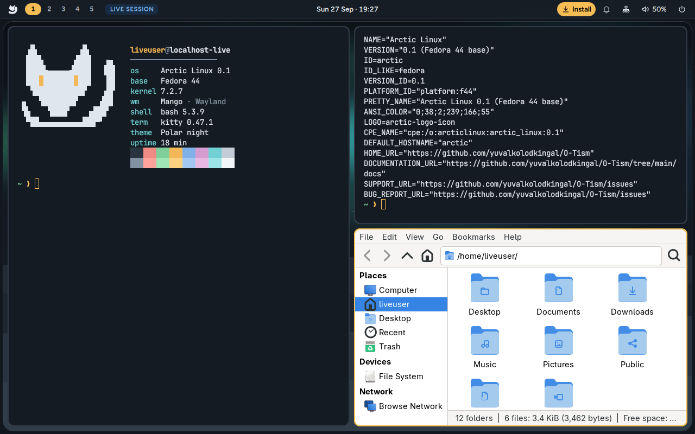
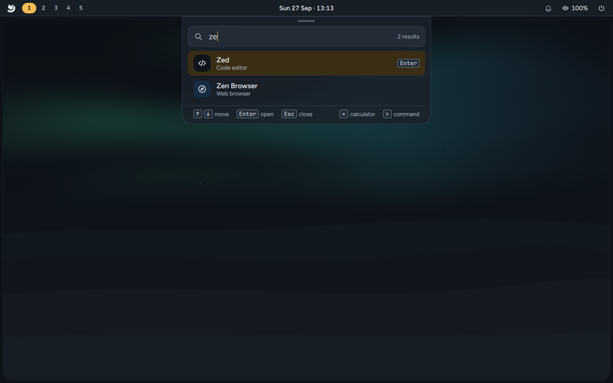
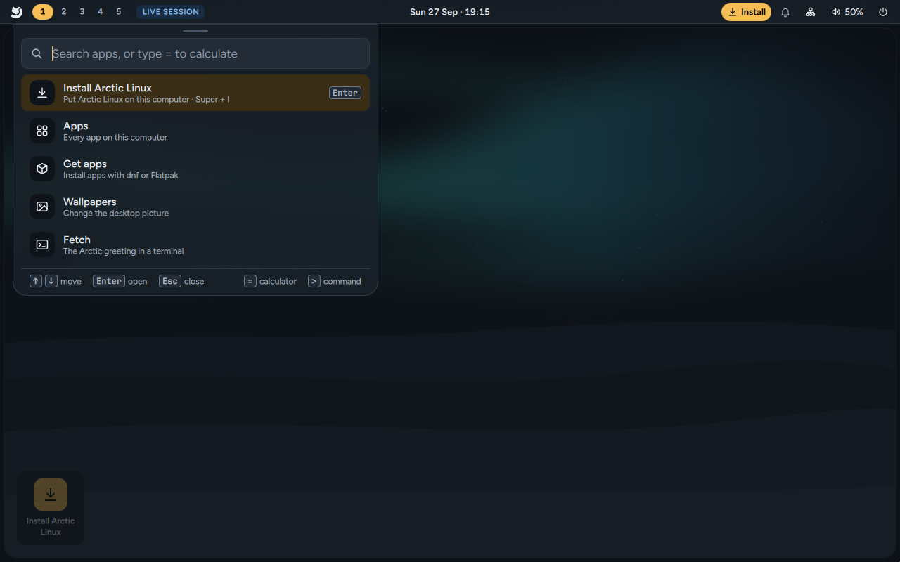
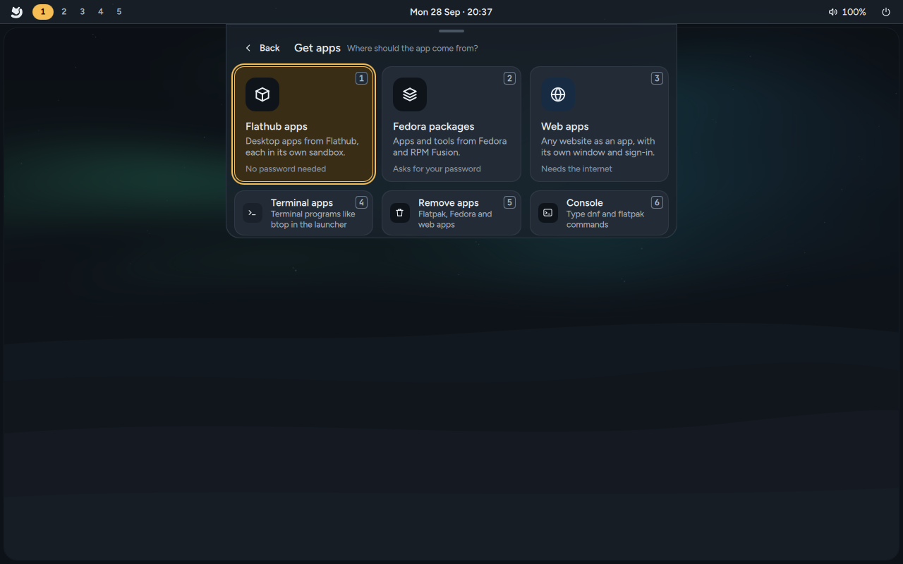
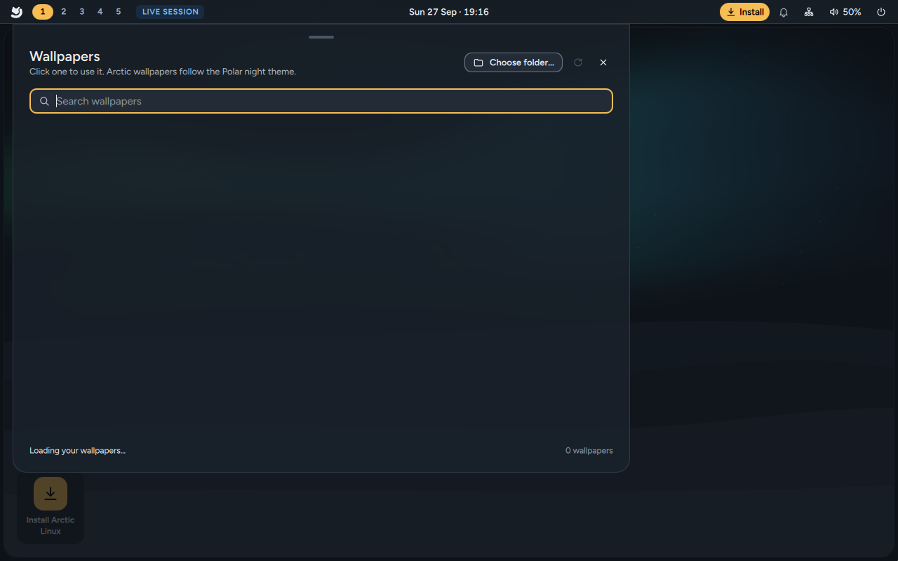
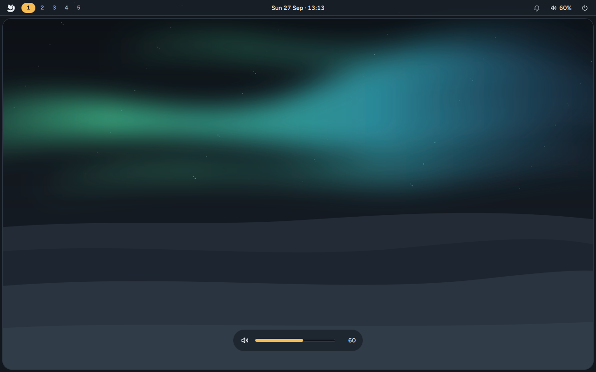
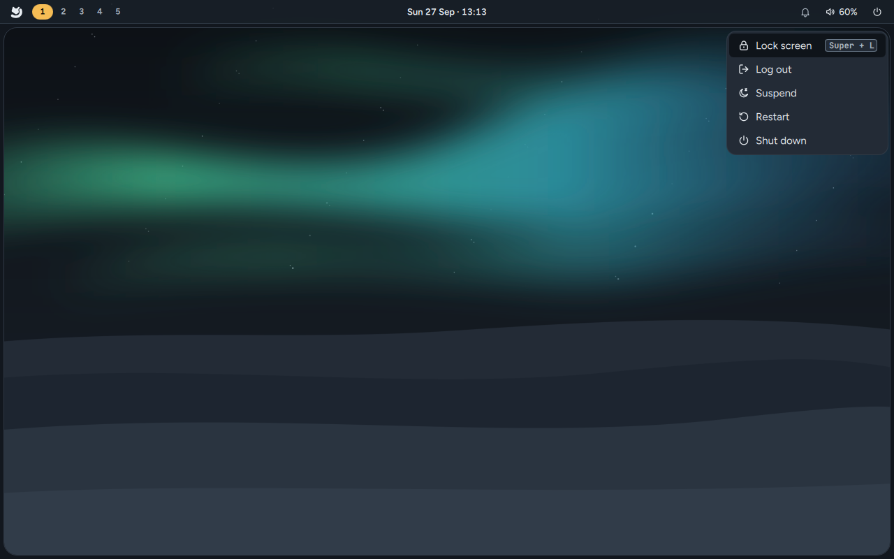
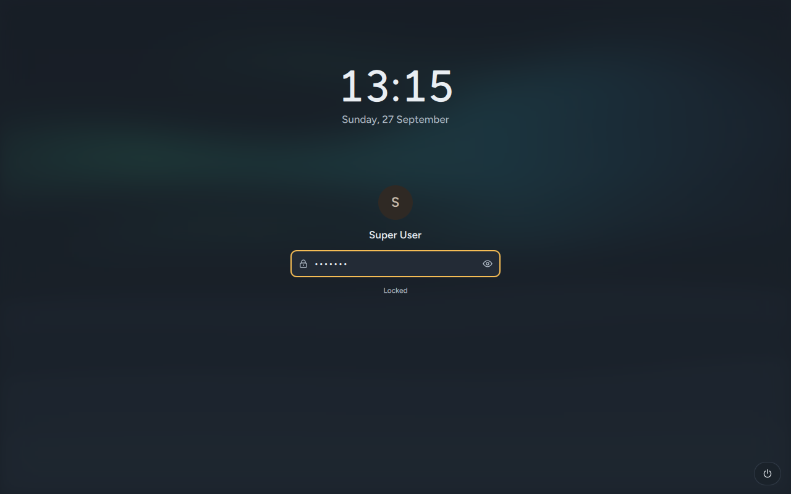
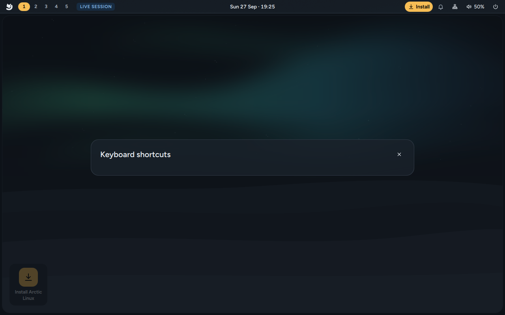
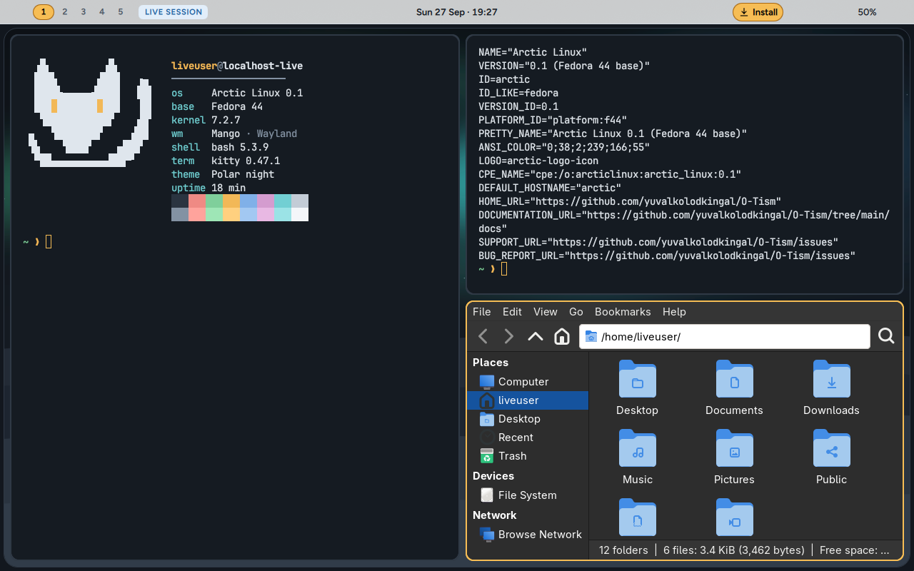

# Desktop tour

The Arctic Linux desktop is Mango, a tiling window manager, with a shell drawn on top of it: the
bar, the launcher, pop-ups and the lock screen. **Arctic Settings** (`Super + S`) changes how it
all looks and works. Everything has a keyboard shortcut (`Super + /` lists them all), and
everything also works with the mouse.

`Super` is the key with the Windows logo on most keyboards.

## The top bar

A thin bar runs along the top of the screen.

**Left**

- **The fox**: opens the launcher (`Super + Space`).
- **Workspaces 1 to 5**: the one you're on is an amber pill, ones with windows have a ring, empty
  ones are plain numbers, and one that wants your attention gets a red ring. Click one to go there.
- **Live session**: only when you're running from the USB stick.

**Centre**

- **The clock**, with the date: `Sun 27 Sep · 16:47`.

**Right**

| Item | Click | Right-click / scroll |
|---|---|---|
| **Install** (amber, live USB only) | Opens the installer | — |
| **Restart to update** (amber, only while updates wait) | Shows the updates and **Restart and install**; see [Updates](Updates) | — |
| **Bell** | Turns do not disturb on or off | Right-click brings back the last notification |
| **Bluetooth** (only with a Bluetooth adapter) | Opens the Bluetooth manager | — |
| **Tray icons** from running apps | The app's own action or menu | Scrolling is passed to the app |
| **Network** | The network menu, to pick a Wi-Fi network | Right-click opens the connection editor |
| **Volume** | Opens the volume mixer | Right-click mutes, scroll changes the volume |
| **Battery** (only on laptops) | — | Hover to see time left or charging state |
| **Power** | Opens the power menu (`Super + Esc`) | — |

Hover over any icon for a tooltip that names it and its shortcut. Anything your computer can't
report (a battery on a desktop PC, Bluetooth without an adapter) is simply hidden.

## The screen frame

A thin rounded frame in the background colour runs around the screen below the bar, so the
desktop reads as one sheet with windows sitting inside it. You can turn it off; see
[Themes and customisation](Themes-and-Customisation#the-screen-frame).

## Windows and workspaces

Mango is a **tiling** window manager: you don't drag windows around to make room. New windows
share the screen automatically. The first window takes the main area on the left, the others
stack on the right. Windows have 8px gaps, rounded corners, and the one you're typing into has an
**amber border**.

- `Super + arrow keys` moves between windows. `Super + Shift + arrow keys` swaps them.
- `Super + Ctrl + ←/→` makes the main area narrower or wider; `Super + Ctrl + ↑/↓` puts more or
  fewer windows in it. `Super + Z` swaps a window with the main one.
- `Super + T` lets a window float above the others. `Super + M` maximises it,
  `Super + Shift + M` makes it full screen.
- `Super + O` shows an overview of all your windows. `Super + N` switches to the next layout.
- `Super + Q` closes a window.
- Hold `Super` and drag with the left mouse button to move a window, or the right button to resize
  it.

Dialogs such as "Open File", the volume mixer and the network editor float in the middle of the
screen by themselves.

**Workspaces** are separate screens for different tasks. There are five. `Super + 1` to `5` goes to
one, `Super + Shift + 1` to `5` moves the current window there, and `Super + Page Up/Down` steps
through them. On a touchpad, swipe with four fingers left or right.

## The launcher

`Super + Space` (or the fox on the bar) opens the launcher. Start typing an app's name and press
`Enter`. Before you type anything, it offers:

- **Apps**: every app on this computer
- **Get apps**: install new apps (see below)
- **Wallpapers**: change the desktop picture
- **Settings**: appearance, displays, keyboard, apps and more (`Super + S`)
- **Fetch**: the fox greeting in a terminal
- **Install Arctic Linux**: only on the live USB

Use `↑` and `↓` to move, `Enter` to open, and `Esc` to go back or close. Press `Super + Space` again
to close it. The launcher hangs from the bar; drag its grip to dock it to another edge of the
screen.

### More than apps

A search finds more than apps. The apps you open most come first.

- **Settings**: a page ("Bluetooth") or a single setting ("Reduce motion") opens Settings
  right at it.
- **Open windows**: `Enter` brings the window forward.
- **What an app can do**: its own actions, like a browser's "New private window".
- **Files and folders** in your home folder, when `fd` is installed (Arctic installs it). `Enter`
  opens one; `Shift + Enter` opens the folder it's in.
- **Unit conversions**: `10 km to mi` or `72 °F to °C`, when `qalc` is installed (Arctic installs
  it). `Enter` copies the answer.
- **The web**: the last row searches the web for what you typed. Start with `?` to search only
  the web. Pick the search engine in Settings › Default apps › Web search.

### Reminders: start with `remind`

`Super + Ctrl + R` opens the launcher with `remind ` typed. Say when, then what: `remind 10m tea`,
`remind 1h 30m stretch`, `remind me at 17:30 to call Ana` or `remind 5pm leave`. The row shows
when it will be; `Enter` sets it. When it's time, a notification you can't miss says it, with
**Again in 10 minutes**. A reminder set before the laptop sleeps still comes when it wakes, but
not after a restart. `arctic-remind list` shows what's set; **Cancel reminders** is in the
[command menu](Command-Menu) (Apps).

### Calculator: start with `=`

Type `=` and a sum, like `=12*4` or `=(3+4)^2`. The answer appears as you type; `Enter` copies it
to the clipboard. It understands `+ - * / % ^`, brackets, `pi` and `e`, and `sqrt`, `abs`, `round`,
`floor`, `ceil`, `sin`, `cos`, `tan`, `asin`, `acos`, `atan`, `ln`, `log` and `exp`. What it can't
work out (units, currencies, `= 3 h to min`) goes to `qalc` when that is installed.

### Commands: start with `>`

Type `>` and a command, like `> htop`. `Enter` runs it in the background; `Shift + Enter` runs it
in your terminal and keeps the window open so you can read the output.

## Get apps

`Super + Shift + A`, or **Get apps** in the launcher, opens a small console for installing apps.
Type an app's name and press `Enter` to install it, and `Tab` to complete a name. Installs run on
their own, without `[y/N]` questions; your password is asked once, in a dialog. Full details are
on [Apps and software](Apps-and-Software#get-apps).

## Settings

`Super + S` opens **Arctic Settings**. It's also in the launcher and first in the power menu.
Pick a page on the left, or start typing to search every setting:

| Page | Changes |
|---|---|
| **Appearance** | Theme, colours from the wallpaper, light or dark, wallpaper, reduced motion, text and pointer size |
| **Windows** | Gaps, borders, rounded corners, animations, blur, shadows, focus, the default layout |
| **Displays** | Resolution, scale, rotation and position of each screen |
| **Keyboard and mouse** | Layout, key repeat, touchpad and mouse |
| **Shortcuts** | Your own shortcuts |
| **Default apps** | The browser, terminal, file manager and editor the shortcuts open, and the apps for links and files |
| **Network**, **Bluetooth**, **Sound** | Wi-Fi, Bluetooth devices, speakers and microphones |
| **Updates** | What's waiting, automatic updates and the channel |
| **Power and lock** | Power mode, when the screen locks and when the computer sleeps |
| **Startup apps** | Apps that start when you log in |
| **About** | This computer and Arctic Linux |

Changes apply straight away, and `Ctrl + Z` undoes the last one. Everything is on
[Settings](Settings).

## Wallpapers

`Super + Shift + W` (or **Wallpapers** in the launcher) opens the wallpaper picker. Click a picture
to use it, or search by name.

- **Arctic wallpapers**: Snowfield, Aurora and Fox. Each has a Winter and a Polar night version,
  and they switch along with the theme ("Follows the theme").
- **Your own pictures**: put them in `~/Pictures/Wallpapers`, or click **Choose folder…** to use
  another folder. Your own picture stays the same when you switch themes.
- **Match colours to wallpaper** (the switch at the bottom, on by default): with one of your own
  pictures, the whole desktop takes its colours from it: the accent, the window borders, the
  terminal and your apps. Arctic's own wallpapers keep the Winter and Polar night colours. See
  [Themes and customisation](Themes-and-Customisation#colours-from-your-wallpaper).

## Notifications and do not disturb

Notifications appear as cards in the top-right corner of the screen and go away after a few
seconds; urgent ones have a red edge and stay until you dismiss them.

- `Super + Delete` dismisses the newest one, `Super + Shift + Delete` dismisses them all.
- **Do not disturb** (`Super + Shift + N`, or click the bell) hides everything except urgent
  notifications. The bell icon changes while it's on.
- Right-click the bell to bring back the last notification you dismissed.

## Volume and brightness

The volume, mute and brightness keys on your keyboard show a small pop-up at the bottom of the
screen with the new level. It fades after a moment. The volume pop-up also appears when an app
changes the volume. These keys work on the lock screen too. Brightness never goes all the way to a
black screen.

## The power menu

`Super + Esc`, or the power icon on the bar, opens the power menu: **Settings**, **Lock screen**,
**Log out**, **Suspend**, **Restart** and **Shut down**. On the live USB it has **Settings**,
**Restart** and **Shut down**.

## The lock screen

`Super + L` locks the screen. It shows your wallpaper blurred behind a frosted card with the
clock, your picture (`~/.face`, or your initial) and name, and a password field. The field's ring
is amber while you type, red when the password is wrong and green when it's accepted. Battery,
Wi-Fi and power buttons sit in the bottom-right corner.

The screen also locks by itself after 5 minutes without use and before the computer sleeps; the
computer suspends after 15 minutes. The session stays locked even if the desktop shell stops.
There's no lock screen in the live session.

## The shortcut sheet

`Super + /` opens a sheet with every shortcut. Press `Esc` to close it. The same list is on
[Keyboard shortcuts](Keyboard-Shortcuts).

## Screenshots and the clipboard

- `Print` lets you select an area, `Shift + Print` takes the whole screen, `Super + Print` the
  current window. Screenshots are saved in `~/Pictures/Screenshots` and copied to the clipboard.
- `Super + V` shows your clipboard history. Pick an entry to copy it again.

## Password prompts

When an app needs permission for a system change, a password dialog appears. Type your account
password to allow it.

## The terminal and the theme

`Super + Enter` opens a terminal, where a small fox greets you. See
[Terminal and shell](Terminal-and-Shell). `Super + Shift + T` switches the whole desktop between the
light Winter and the dark Polar night themes (or, when the colours come from your wallpaper,
between its light and dark versions):

More on [Themes and customisation](Themes-and-Customisation).
