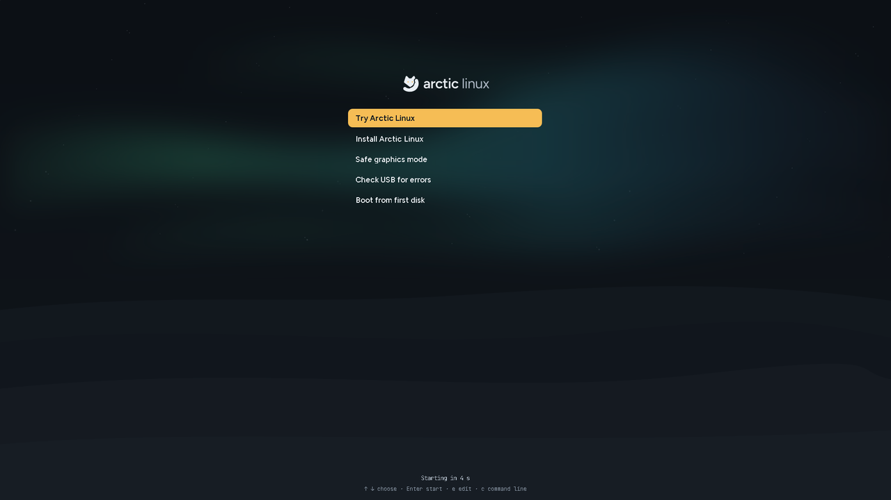

# Download and create a USB

Arctic Linux comes as one file, an ISO image. You write it to a USB stick, start your computer
from the stick, and choose whether to try Arctic Linux or install it.

## What you need

- **A 64-bit PC** (x86_64). Newer computers (UEFI) and older ones (BIOS) both work.
- **A USB stick of 4 GB or more.** Writing Arctic Linux to it erases everything on it.
- **To install:** at least **40 GB** of disk space and an **internet connection** (Wi-Fi or a
  cable). The installer downloads the apps you pick, and any driver your computer needs, while
  it runs. Trying Arctic Linux needs neither.
- **Memory:** our tests run the live USB with 4 GB and the installer with 6 GB.

## 1. Download the image

Open the [latest release](https://github.com/yuvalkolodkingal/O-Tism/releases/latest) and, under
**Assets**, download both files:

| File | What it is |
|---|---|
| `Arctic-Linux-0.2-x86_64.iso` | The USB image |
| `Arctic-Linux-0.2-x86_64.iso.sha256` | Its checksum, to check the download |

The release notes mention it when this build has Zen Browser preinstalled for the live session.

### If the release has `.part00`, `.part01` … files

GitHub limits each download to 2 GB. When an image is larger than that, it's published in parts.
Download every `Arctic-Linux-0.2-x86_64.iso.partNN` file and the `.sha256` file into one folder,
then join them:

```sh
# Linux or macOS
cat Arctic-Linux-0.2-x86_64.iso.part* > Arctic-Linux-0.2-x86_64.iso
```

```powershell
# Windows (PowerShell), listing every part in order
cmd /c copy /b Arctic-Linux-0.2-x86_64.iso.part00+Arctic-Linux-0.2-x86_64.iso.part01 Arctic-Linux-0.2-x86_64.iso
```

## 2. Check the download

A check makes sure the file arrived complete. Run it in the folder with both files.

**Linux**

```sh
sha256sum -c Arctic-Linux-0.2-x86_64.iso.sha256
```

It prints `Arctic-Linux-0.2-x86_64.iso: OK` when the file is good.

**macOS**

```sh
shasum -a 256 -c Arctic-Linux-0.2-x86_64.iso.sha256
```

**Windows (PowerShell)**

```powershell
Get-FileHash .\Arctic-Linux-0.2-x86_64.iso -Algorithm SHA256
```

Compare the long number it prints with the one in the `.sha256` file (open it in Notepad). If
they differ, download the image again.

## 3. Write it to the USB stick

> **Everything on the USB stick is erased.** Copy anything you want to keep off it first.

### With Fedora Media Writer (Windows, macOS, Linux)

[Fedora Media Writer](https://fedoraproject.org/workstation/download) is the easiest way.

1. Install it and open it.
2. Choose the option to use an `.iso` file you already have, and pick
   `Arctic-Linux-0.2-x86_64.iso`.
3. Pick your USB stick and write the image.

### With `dd` (Linux)

Find your USB stick's name first. Run `lsblk` before and after plugging it in: the new entry
(for example `sdb`) is your stick. Then write the image, replacing `sdX` with that name:

```sh
sudo dd if=Arctic-Linux-0.2-x86_64.iso of=/dev/sdX bs=4M status=progress oflag=sync
```

Double-check the name: `dd` overwrites whatever disk you give it without asking.

### With `dd` (macOS)

```sh
diskutil list                         # find the stick, for example /dev/disk4
diskutil unmountDisk /dev/disk4
sudo dd if=Arctic-Linux-0.2-x86_64.iso of=/dev/rdisk4 bs=4m
```

### With Ventoy

[Ventoy](https://www.ventoy.net) lets one USB stick hold several ISO images and shows a menu of
them when the computer starts. Arctic Linux 0.2 works from it: copy
`Arctic-Linux-0.2-x86_64.iso` onto the Ventoy stick like any other file, start the computer from
the stick and pick it in Ventoy's menu. The other files on the stick stay as they are. Check
the download first (step 2), and join the parts if the release has them. Both **Try Arctic Linux** and **Install Arctic Linux**
work, and the installer never offers the Ventoy stick as a disk to install on.

One difference: the installer's **Save log to USB** can't write to the Ventoy stick you started
from (its partition is in use while Arctic Linux runs), so plug in a second USB stick if you need
the log. With Secure Boot on, Ventoy asks you to enroll its own key the first time; see Ventoy's
documentation.

## 4. Start your computer from the USB stick

1. Plug the stick in and restart the computer.
2. While it starts, press its boot menu key. It's often `F12`, `F11`, `F10`, `F8` or `Esc`;
   the start-up screen usually says which one.
3. Pick the USB stick from the list.

The stick uses Fedora's signed boot loader, so it's made to start with Secure Boot turned on. If
your computer still won't start from it, see [Troubleshooting](Troubleshooting#the-usb-stick-doesnt-start).

## The boot menu



The boot menu appears first. If you don't press anything, **Try Arctic Linux** starts after 5
seconds; the countdown is shown at the bottom.

| Entry | What it does |
|---|---|
| **Try Arctic Linux** | Runs the full desktop from the USB stick. Nothing is written to your computer. See [Try Arctic Linux](Try-Arctic-Linux). |
| **Install Arctic Linux** | Opens the installer straight away. See [Install Arctic Linux](Install-Arctic-Linux). |
| **Safe graphics mode** | Like Try, but with basic graphics. Use it if the screen stays black or looks wrong. |
| **Check USB for errors** | Checks the stick for damaged data before starting. Use it if Arctic Linux behaves strangely. |
| **Boot from first disk** | Leaves the USB stick and starts whatever is installed on your computer. |

Use `↑` and `↓` to move and `Enter` to start the selected entry.

Next: [Try Arctic Linux](Try-Arctic-Linux) or [Install Arctic Linux](Install-Arctic-Linux).
