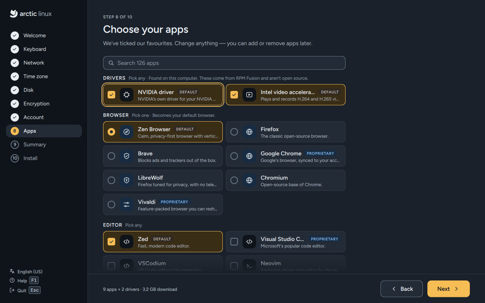
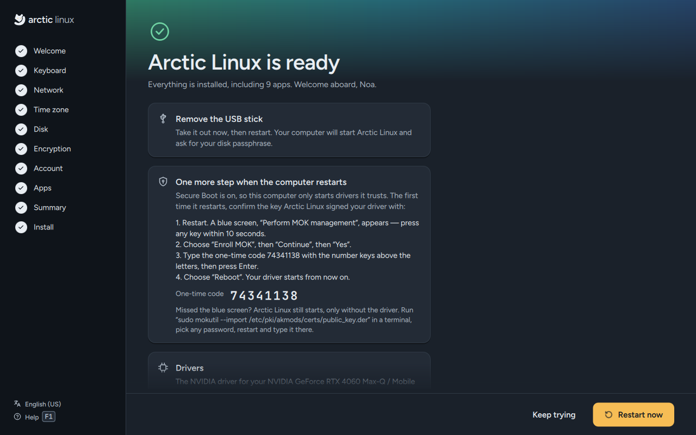
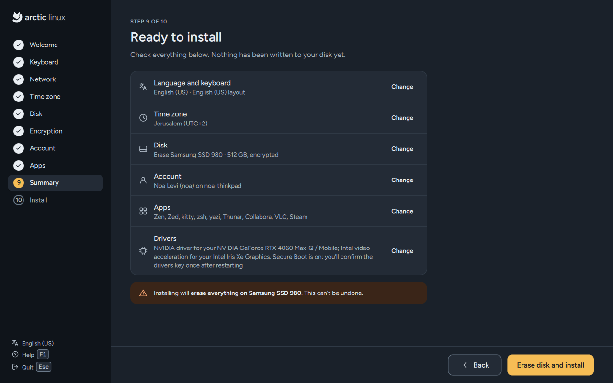

# Drivers

Most hardware works with the open-source drivers that come with Fedora. For a few kinds of
hardware a driver from RPM Fusion works better, or is the only one that works at all. From
version 0.2, the installer finds that hardware and sets up the driver for you.

The NVIDIA and Broadcom drivers aren't open source. The Intel and AMD video drivers are open
source, but they play formats Fedora leaves out for patent reasons, so they come from RPM Fusion
too. (The installer's Drivers section calls them all "not open source".)

## What the installer looks for

When the installer starts, it reads the PCI devices of the computer (graphics cards, Wi-Fi cards)
and compares them with the drivers it knows. Each one that matches shows up in a **Drivers**
section at the top of the Apps step, already ticked, with the name of your device:



*"Found on this computer. These come from RPM Fusion and aren't open source."* If nothing
matches, there's no Drivers section. Untick a driver to keep the open-source one; the
[Summary](Install-Arctic-Linux) then says *"None — your hardware keeps its open-source drivers"*.

| Driver | Offered for | What gets installed |
|---|---|---|
| **NVIDIA driver** | NVIDIA cards from the Turing generation on: GeForce RTX 20 series, GTX 16 series and every newer card, including the NVIDIA GPU of a laptop | `akmod-nvidia`, `xorg-x11-drv-nvidia-cuda`, `libva-nvidia-driver` (about 540 MB) |
| **NVIDIA driver (580 series)** | Maxwell, Pascal and Volta cards: GeForce GTX 750 to GTX 1080 Ti, and Titan V. The 580 series is the last NVIDIA driver for them | `akmod-nvidia-580xx`, `xorg-x11-drv-nvidia-580xx-cuda`, `libva-nvidia-driver` (about 510 MB) |
| **Intel video acceleration** | Intel graphics from Broadwell (5th generation Core) on, including Arc cards | `intel-media-driver` in place of Fedora's `libva-intel-media-driver` |
| **AMD video acceleration** | AMD Radeon graphics from the HD 2000 series on, and Ryzen APUs | `mesa-va-drivers-freeworld` beside Fedora's driver, and `mesa-vulkan-drivers-freeworld` in place of `mesa-vulkan-drivers` |
| **Broadcom Wi-Fi driver** | Broadcom Wi-Fi chips with no working open driver (BCM4311, 4312, 4321, 4322, 4331, 43142, 4352, 4360) | `akmod-wl`, `broadcom-wl` |

- **The NVIDIA drivers** give full speed for games, video and 3D apps, CUDA, and hardware video
  encoding and decoding. Without them, NVIDIA cards run on the open `nouveau` driver, which is
  much slower on most cards.
- **The video acceleration drivers** let the graphics chip play and record H.264 and H.265 (HEVC)
  video instead of the processor. Fedora's own builds leave these formats out for patent reasons;
  RPM Fusion's include them.
- **The Broadcom driver** is what makes those Wi-Fi cards work at all. Until it's installed, the
  Network step says so: *"Your {device} needs Broadcom's driver, which Arctic Linux installs for
  you. Until then, connect a network cable or share your phone's connection over USB."*

Older NVIDIA cards (Kepler and before, for example GeForce GTX 600 and most of the 700 series)
get no driver: NVIDIA's drivers for them lack what the Mango desktop needs to draw with them, so
they keep `nouveau`.

All of these come from [RPM Fusion](https://rpmfusion.org), the community repository for software
Fedora can't ship. The installer adds RPM Fusion's `free` and `nonfree` repositories to the new
system only when you install one of these drivers, and from then on the drivers update with the
rest of the system.

## How the NVIDIA and Broadcom drivers are installed

The NVIDIA and Broadcom drivers are kernel modules. They're built on your computer, for your
kernel, by **akmods**. The installer does that before the first start, so the driver works from
the first login:

1. It installs `akmods` with the development files of the new system's kernel, and creates a
   signing key for the drivers akmods builds (`/etc/pki/akmods/certs/public_key.der`).
2. It installs the driver's packages from RPM Fusion, together with your apps.
3. It builds the module for every installed kernel and checks it's there (`modinfo`).
4. For NVIDIA it adds the kernel options that turn off `nouveau` and turn on NVIDIA's kernel mode
   setting, which Mango needs:
   `rd.driver.blacklist=nouveau,nova_core modprobe.blacklist=nouveau,nova_core nvidia-drm.modeset=1`.
   With an encrypted disk on a computer whose NVIDIA card draws the screen, it also adds
   `plymouth.use-simpledrm=1`, so the passphrase prompt shows before the driver loads.
5. With Secure Boot on, it asks the computer to trust the signing key (below).

Building takes a few minutes. When a new kernel arrives with an update, `akmods` builds the driver
for it by itself at the next start, signed with the same key.

The video acceleration drivers are ordinary libraries: no build, no key, no restart needed.

If the build fails, the installer pauses on *"The NVIDIA driver couldn't be installed"* with
*"The driver didn't build for this computer's kernel."* **Try again**, or **Skip the driver**:
the driver's packages are removed again and your card keeps the open-source driver. Everything
else installs normally.

### Installing offline

Drivers are downloaded, so without a connection when the install starts they're put off. The
Done screen says *"The NVIDIA driver for your … is installed the first time Arctic Linux is
online. Restart once more after that."* `arctic-firstboot` installs and builds the driver as
soon as the computer is online, and adds the kernel options. Check on it with:

```sh
cat /var/lib/arctic/pending.json
journalctl -u arctic-firstboot
```

## Secure Boot: confirming the driver's key

On a computer with Secure Boot on, the firmware only starts kernel modules signed by a key it
trusts. The NVIDIA and Broadcom modules are signed with the key akmods made on your computer, so
the computer has to be told once to trust it. The installer queues the key and shows a
**one-time code** on the Done screen:



Write the code down (or take a photo of it) before you press **Restart now**. The Summary already
warns you: *"Secure Boot is on: you'll confirm the driver's key once after restarting"*.



At the first restart:

1. A blue screen, **Perform MOK management**, appears. **Press any key within 10 seconds.** (If
   you miss it, see [Missed the blue screen](#missed-the-blue-screen).)
2. Choose **Enroll MOK**, then **Continue**, then **Yes**.
3. Type the one-time code with the number keys above the letters (not the number pad), then
   press `Enter`.
4. Choose **Reboot**. The driver starts from now on.

"MOK" is a Machine Owner Key: a key you, the owner of the computer, add to the ones Secure Boot
trusts. MokManager is part of shim, Fedora's signed boot loader. The code is only used for this
one step; it's never written to the installer's log.

This happens only once. Later kernels and driver updates are signed with the same key.

If you installed offline, the blue screen comes at the restart **after** the driver was installed
at first boot; the Done screen says *"One more step once your driver is installed"*, and the
same code applies.

### Missed the blue screen

Arctic Linux still starts, only without the driver (the screen works on the open driver, or on
basic graphics). Queue the key again, choosing a password of your own:

```sh
sudo mokutil --import /etc/pki/akmods/certs/public_key.der
```

Pick any password you'll remember for a minute, restart, and on the blue screen choose **Enroll
MOK**, **Continue**, **Yes**, type that password, then **Reboot**.

If the installer couldn't queue the key itself, the Done screen says *"Your driver needs Secure
Boot's approval"* and shows these same steps. Turning Secure Boot off in the firmware settings
also works.

Check whether the key is trusted:

```sh
mokutil --sb-state                                                  # SecureBoot enabled?
mokutil --test-key /etc/pki/akmods/certs/public_key.der             # "is already enrolled"?
```

## Laptops with two graphics chips

Most laptops with an NVIDIA GPU also have Intel or AMD graphics in the processor, which drives the
built-in screen. Arctic Linux keeps drawing the desktop on that integrated chip, which saves
battery; the NVIDIA driver is installed for the NVIDIA chip, and apps use it when you ask them to.
To run an app on the NVIDIA chip:

```sh
__NV_PRIME_RENDER_OFFLOAD=1 __GLX_VENDOR_LIBRARY_NAME=nvidia app-name   # OpenGL apps
__NV_PRIME_RENDER_OFFLOAD=1 app-name                                   # Vulkan apps
```

In Steam, put the same in a game's **Launch options**, followed by `%command%`.

On a desktop whose monitors are plugged into the NVIDIA card, the NVIDIA card draws everything,
and Arctic Linux sets `LIBVA_DRIVER_NAME=nvidia`, `NVD_BACKEND=direct` and
`__GLX_VENDOR_LIBRARY_NAME=nvidia` for your session (`/etc/profile.d/arctic-graphics.sh`), so
video playback and OpenGL use NVIDIA's driver.

## Checking the driver

| What | Command |
|---|---|
| Is NVIDIA's driver running, and on which card? | `nvidia-smi` |
| Which driver each graphics card uses | `lspci -k \| grep -EA3 'VGA\|3D'` |
| Is the module built for this kernel? | `modinfo -F version nvidia` (or `wl` for Broadcom) |
| Is it loaded? | `lsmod \| grep -E 'nvidia\|nouveau\|^wl'` |
| The kernel options | `cat /proc/cmdline` |
| Video acceleration | `vainfo` (from the `libva-utils` package) |
| akmods' build log | `journalctl -b -u akmods` and `/var/cache/akmods/` |

`modinfo` printing a version but `lsmod` showing no `nvidia` usually means Secure Boot refused the
module: see [Missed the blue screen](#missed-the-blue-screen). `journalctl -b -k | grep -i
'key\|nvidia'` shows the refusal.

## Troubleshooting

### Black screen after installing the NVIDIA driver

1. Wait a minute on the first start: if a new kernel arrived, akmods may still be building.
2. Switch to a text console with `Ctrl + Alt + F3`, log in, and check with the commands above.
3. To start once without the NVIDIA driver, press `e` in the boot menu (it shows for 5 seconds),
   and on the line starting with `linux` remove `rd.driver.blacklist=nouveau,nova_core
   modprobe.blacklist=nouveau,nova_core nvidia-drm.modeset=1`, then press `Ctrl + X`. The card
   then starts on `nouveau`.

### Going back to nouveau for good

Remove the driver and its kernel options:

```sh
sudo dnf remove 'akmod-nvidia*' 'xorg-x11-drv-nvidia*' 'kmod-nvidia*'
sudo grubby --update-kernel=ALL --remove-args="rd.driver.blacklist=nouveau,nova_core modprobe.blacklist=nouveau,nova_core nvidia-drm.modeset=1"
sudo systemctl reboot
```

### The driver stopped working after an update

The update most likely brought a kernel akmods couldn't build for yet (NVIDIA's driver sometimes
needs a few days to catch up with a new kernel). Start the previous kernel from the boot menu (see
[Updates](Updates#start-the-previous-kernel)), then rebuild once updates have arrived:

```sh
sudo dnf upgrade
sudo akmods --force --kernels "$(uname -r)"      # build for the kernel you're running
sudo akmods --force                              # or for every installed kernel
```

akmods needs the `kernel-devel` package of each kernel it builds for; check with
`rpm -q kernel-devel`.

### Adding a driver you skipped

Enable RPM Fusion (only needed if the installer didn't install any driver), then install the
driver:

```sh
sudo dnf install \
  https://mirrors.rpmfusion.org/free/fedora/rpmfusion-free-release-$(rpm -E %fedora).noarch.rpm \
  https://mirrors.rpmfusion.org/nonfree/fedora/rpmfusion-nonfree-release-$(rpm -E %fedora).noarch.rpm
sudo dnf install akmod-nvidia xorg-x11-drv-nvidia-cuda libva-nvidia-driver   # RTX 20 / GTX 16 and newer
```

For a GTX 750 to 1080 Ti use `akmod-nvidia-580xx xorg-x11-drv-nvidia-580xx-cuda` instead. Wait
a few minutes for akmods to finish building (`modinfo -F version nvidia` prints a version). The
driver's package turns `nouveau` off by itself; add the option the installer would have added with
`sudo grubby --update-kernel=ALL --args=nvidia-drm.modeset=1`, then restart. With Secure Boot on, make
sure akmods has a key **before** the driver is built (`sudo kmodgenca -a`), and afterwards enroll
it as in [Missed the blue screen](#missed-the-blue-screen).

### Wi-Fi doesn't work on a Broadcom card

- Installed offline: the driver comes when the computer is first online, so use a network cable
  or USB tethering from your phone for that first time.
- With Secure Boot on, the `wl` module only loads once the key is enrolled.
- Check with `lsmod | grep wl` and `modinfo -F version wl`.

See also [Troubleshooting](Troubleshooting) and the [FAQ](FAQ).
