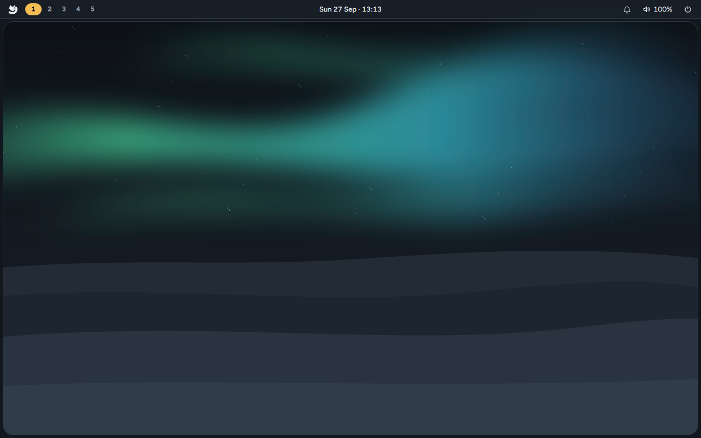

# First boot

You've pressed **Restart now** and taken the USB stick out. Here's what happens next.

## 1. The boot menu

For a few seconds you may see the Arctic Linux boot menu. If you installed alongside another
system, it's listed here too; otherwise the menu simply starts Arctic Linux after 5 seconds.

## 2. Your disk passphrase


If you kept encryption on, the fox start-up screen asks you to **Enter your disk passphrase**.
Type the passphrase you chose in the installer and press `Enter`. Dots show as you type, and a
**Caps Lock is on** hint appears if it is.

- This happens every time the computer starts, before anything else, because your whole system
  is encrypted until you type it.
- If you picked Hebrew, Arabic, Greek, Russian or Ukrainian as your keyboard, type the passphrase
  with English (US) letters, as the installer asked.
- If you used **Use this password for the disk passphrase too**, it's your account password.

Without encryption, this step doesn't appear.

## 3. The login screen


Next comes the login screen: a clock and a frosted card with your name and a password field.
Type your account password and press `Enter`.

- A wrong password shakes the card and says *"That password didn't work"*.
- A hint shows when Caps Lock is on.
- **Bottom left:** the session menu, which picks the desktop session to start (Arctic Linux has one, Mango).
- **Bottom right:** your keyboard layout, and **Suspend**, **Restart** and **Shut down**.
- With more than one account, pick yours with `Tab` and the arrow keys.

If you chose **Log in automatically** in the installer, the login screen is skipped and you go
straight to the desktop after the disk passphrase.

## 4. Your desktop



You start in the **Polar night** theme with the aurora wallpaper. From here:

| Press | To |
|---|---|
| `Super + Space` | Open the launcher |
| `Super + Enter` | Open a terminal (and meet the fox) |
| `Super + W` | Open your browser |
| `Super + /` | See every shortcut |
| `Super + Shift + T` | Switch to the light Winter theme |

The [desktop tour](Desktop-Tour) walks through the rest.

## What's already set up

- **Your apps**: the ones you ticked in the installer. `Super + Enter`, `Super + W`, `Super + E`
  and `Super + F` open the terminal, browser, editor and file manager you picked.
- **Your language, keyboard layout, time zone and computer name.** The clock keeps itself right
  over the internet, unless you turned that off.
- **Wi-Fi**: networks you joined in the installer are remembered.
- **Media codecs**: the installer adds the RPM Fusion repositories, full FFmpeg and OpenH264, so
  most video and audio files play.
- **Screen locking**: the screen locks after 5 minutes without use, and the computer suspends
  after 15 minutes. It always locks before it sleeps.
- **Security**: SELinux is on, the `root` account is locked, and there's no SSH server.
- **Flatpak and Nix**, ready to use. See [Apps and software](Apps-and-Software).

## Apps that finish installing after first boot

Sometimes an app can't be downloaded during the install.

- **If you used the installer**, it asked you: **Try again** or **Skip**. An app you skipped isn't
  installed and isn't retried by itself. The Done screen listed it; add it with
  [Get apps](Apps-and-Software#get-apps) (`Super + Shift + A`) whenever you like.
- **In an automated (unattended) install**, an app that can't be downloaded is retried once and
  then put off until later. It's written to `/var/lib/arctic/pending.json`, and the
  **arctic-firstboot** service installs it after the computer starts and is online.

arctic-firstboot runs in the background and never holds up the login screen. It tries each app
the same way the installer would have (dnf, COPR, Flatpak or Nix), removes the ones that worked
from the list, and deletes the list when it's empty. Anything that still fails is tried again at
the next start.

To see what's still waiting and what happened:

```sh
cat /var/lib/arctic/pending.json          # apps still waiting (no file: nothing left)
journalctl -u arctic-firstboot            # what arctic-firstboot did
sudo systemctl start arctic-firstboot     # try again now, without restarting
```

## Keep it up to date

Arctic Linux updates itself: about ten minutes after the first start, and every day after that,
it downloads updates in the background, and installs them the next time the computer starts.
When some are waiting, the bar shows **Restart to update**. See [Updates](Updates).

The installer installs the system as it is on the USB stick, so the first check usually finds
updates. To get them right away:

```sh
arctic-update now     # download now; installed at the next restart
flatpak update        # Flatpak apps (Zen, Zed, Collabora Office and others)
```

## If something went wrong

- The passphrase isn't accepted, the screen stays black, or the login fails: see
  [Troubleshooting](Troubleshooting#after-installing).
- An app is missing: see [Apps and software](Apps-and-Software) or
  [Troubleshooting](Troubleshooting#an-app-is-missing-after-installing).
