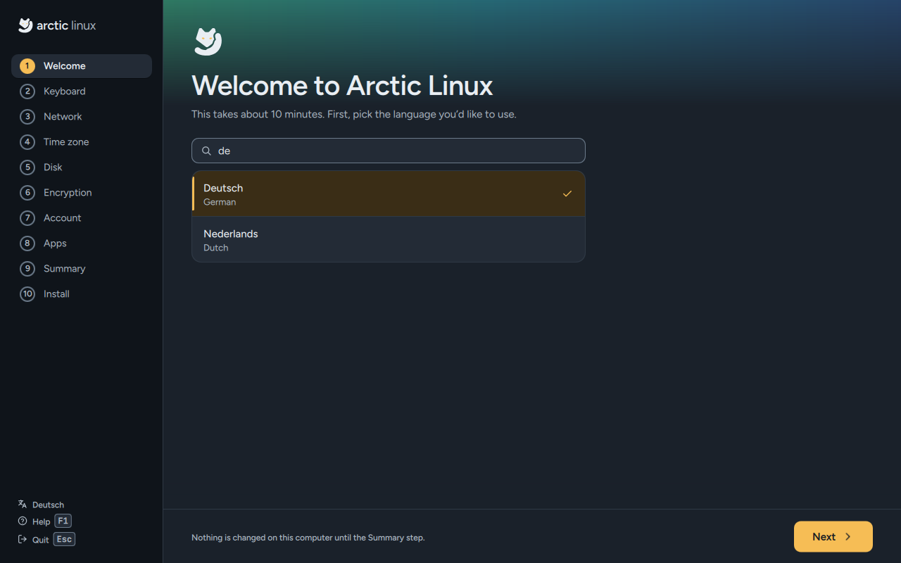
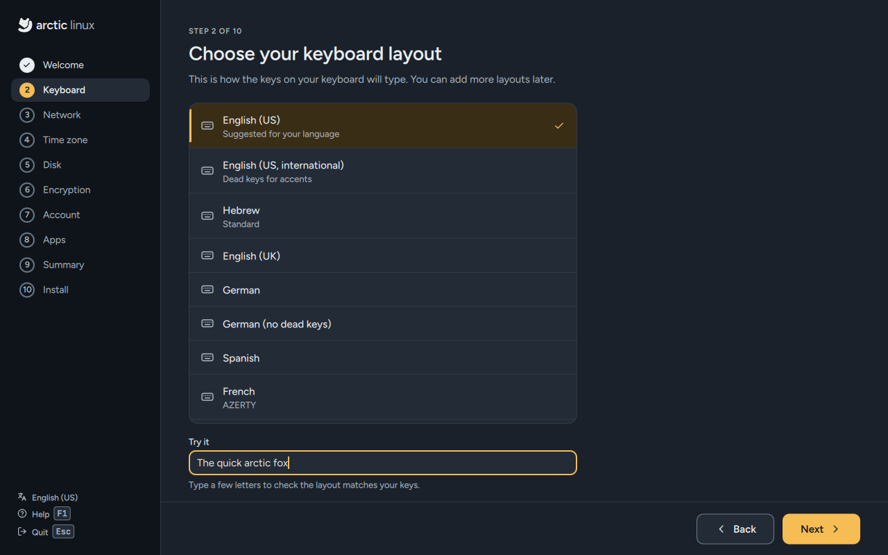
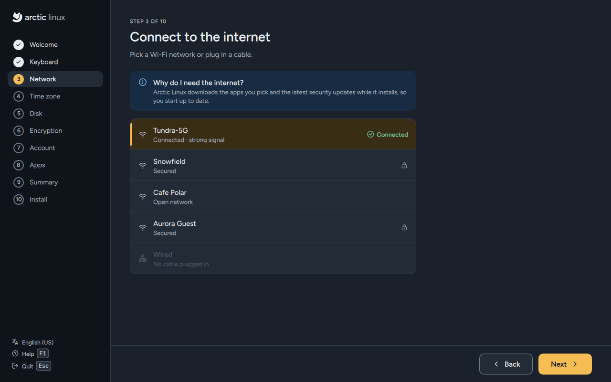
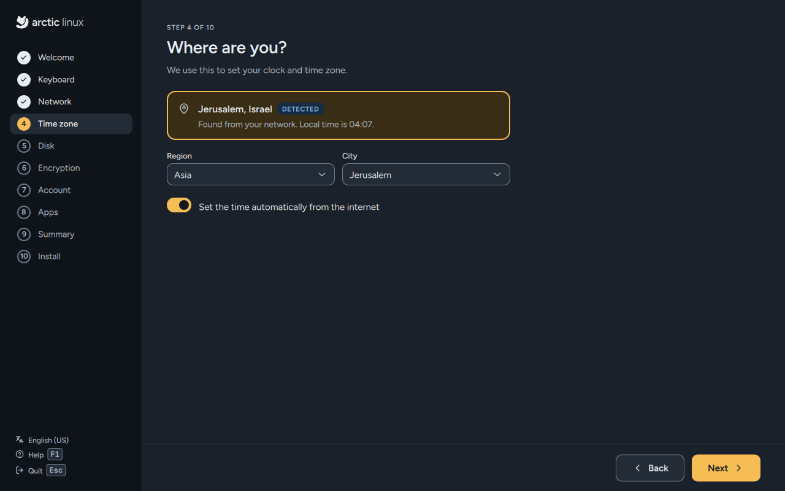
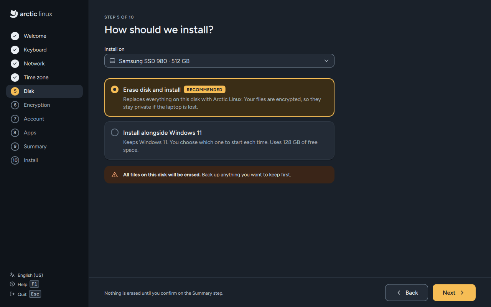
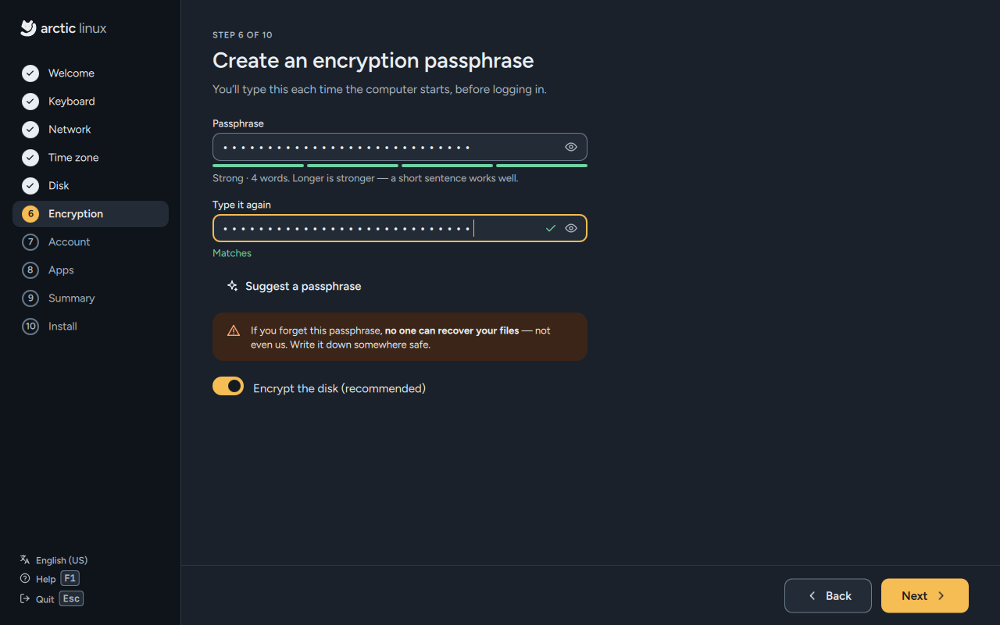
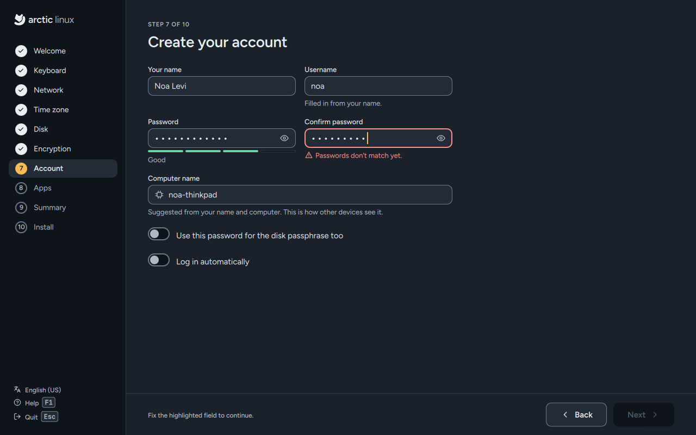
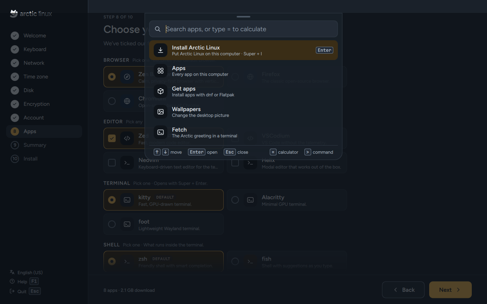
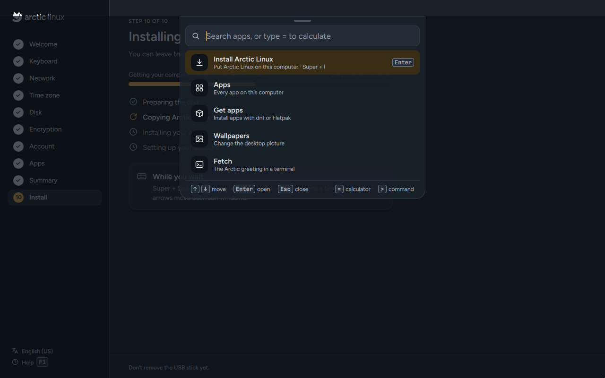
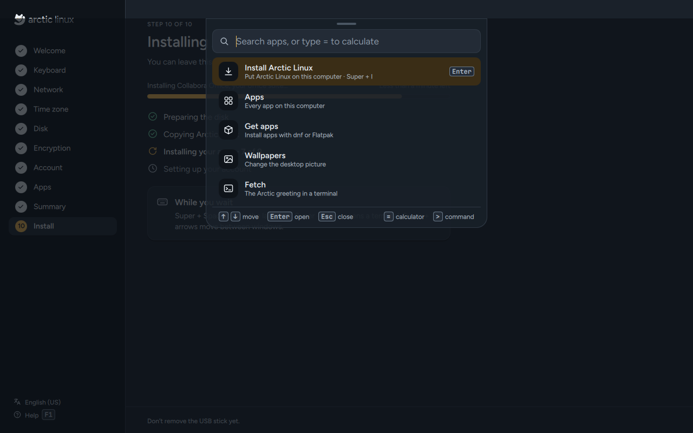

# Install Arctic Linux

The installer asks one question per screen. The recommended answer is always already chosen,
so if you just press `Enter` on each screen you get a good, encrypted system with our favourite
apps. **Nothing is written to your disk until you press the install button on the Summary
screen.** Up to then you can go back, change anything, or quit.

It takes about 10 minutes plus the time to download your apps (and to build a graphics or
Wi-Fi driver, if your computer needs one).

The screenshots on this page come from the installer's demo mode, so the disks, networks and
names in them are examples.

## Before you start

- **Back up** anything you want to keep. Installing can erase the whole disk.
- **Plug your laptop in.** An install that stops halfway because the battery ran out leaves a
  disk that doesn't start.
- **Have your Wi-Fi password ready**, or plug in a network cable. The installer needs the
  internet to download your apps.
- **Keeping Windows?** Make free space for Arctic Linux in Windows first. See
  [Installing alongside Windows](#installing-alongside-windows).

## Opening the installer

- From the boot menu: choose **Install Arctic Linux**. The installer opens full screen as soon as
  the desktop has started.
- From the live desktop ([Try Arctic Linux](Try-Arctic-Linux)): press `Super + I`, or click
  **Install** on the top bar, the **Install Arctic Linux** tile or the welcome card.

## Moving around

The rail on the left lists the ten steps. The current one is marked in amber, and finished steps
get a tick.

| Key | Does |
|---|---|
| `Enter` | Next, once the screen is filled in (not on Summary: there you press the button itself) |
| `Alt + ←` | Back to the previous step |
| `Tab` / `Shift + Tab` | Move between controls |
| Arrow keys, `Space` | Move inside lists, tick and untick |
| `F1` | Help for this screen |
| `Esc` | Quit the installer. Once you've answered something it asks first. You can't quit while it's installing. |

Your mouse or touchpad works everywhere too.

---

## 1. Welcome



**Welcome to Arctic Linux.** *"This takes about 10 minutes. First, pick the language you'd like to
use."*

- **Asks:** the language for your new system. Type in the search box to find it quickly.
- **Already chosen:** the live session's language, which is usually English (US).
- **Good to know:** the installer's own screens are in English. The language you
  pick is the one your installed system uses. At the bottom it reminds you: *"Nothing is changed
  on this computer until the Summary step."*

## 2. Keyboard



**Choose your keyboard layout.** *"This is how the keys on your keyboard will type."*

- **Asks:** your keyboard layout. The one that matches your language is first and marked
  **Suggested for your language**.
- **Try it:** type in the **Try it** box to check that the letters on screen match the keys you
  press. Your choice is applied to the live session straight away, so the passwords you type in
  the next steps are typed exactly as your new system will check them.
- **Hebrew, Arabic, Greek, Russian and Ukrainian:** English (US) is added as a second layout, and
  `Alt + Shift` switches between them. Your disk passphrase (and a password you also use for the
  disk) must be typed with English (US) letters, because the computer asks for it before your own
  layout is loaded.

## 3. Network



**Connect to the internet.** *"Pick a Wi-Fi network or plug in a cable."*

- **Asks:** which Wi-Fi network to join, and its password. A lock shows which networks need one.
- **Skipped automatically** when a network cable is plugged in and you're already online.
- **Next stays off until you're online.** The **Why do I need the internet?** box explains:
  Arctic Linux downloads the apps you pick while it installs.
- The Wi-Fi networks you connect to here are copied to your new system, so it's online the first
  time you log in.

If no networks show up, plug in a cable or move closer to your router. A wrong password says
*"Wrong password. Check it and try again."*

**A Broadcom Wi-Fi card that needs a driver:** some Broadcom chips only work once Broadcom's driver
is installed, so the installer can't use them yet. It tells you so on this screen (*"Your … needs
Broadcom's driver, which Arctic Linux installs for you. Until then, connect a network cable or
share your phone's connection over USB."*), and ticks the driver for you on the Apps step.

## 4. Time zone



**Where are you?** *"We use this to set your clock and time zone."*

- **Asks:** your time zone, as a city.
- **Already chosen:** the city found from your internet connection (*"Found from your network"*).
  If that doesn't work, it's a best guess from your language.
- **Change it** with the **Region** and **City** lists.
- **Set the time automatically from the internet** is on. Leave it on unless you have a reason
  not to.

## 5. Disk



**How should we install?**

- **Install on:** which disk to use. The USB stick you started from is never listed. The disk
  must be at least 40 GB. Already chosen: your computer's internal disk (the largest internal SSD,
  if there are several).
- **Erase disk and install** (*Recommended*, already chosen): *"Replaces everything on this disk
  with Arctic Linux. Your files are encrypted, so they stay private if the laptop is lost."*
- **Install alongside {your other system}**: keeps what's on the disk and uses its free space.
  It only appears when the disk has at least 40 GB of free, unused space (and, on UEFI computers,
  an EFI system partition to share); it also shows how much it will use. See
  [Installing alongside Windows](#installing-alongside-windows).

A warning reminds you: *"All files on this disk will be erased. Back up anything you want to keep
first."* Nothing is erased yet; that only happens after the Summary step.

If you see **No disk to install on**, the computer has no disk of at least 40 GB other than the
USB stick.

## 6. Encryption



**Create an encryption passphrase.** *"You'll type this each time the computer starts, before
logging in."*

- **Asks:** a passphrase, typed twice (**Type it again**).
- **Encrypt the disk (recommended)** is on. Encryption means that if your computer is lost or
  stolen, nobody can read your files without the passphrase.
- **The strength meter** says **Too short**, **Weak**, **Fair**, **Good** or **Strong**, and counts
  the words. Any passphrase is accepted once both fields match. Below **Fair**, a warning says
  *"This passphrase is easy to guess: someone who has your computer could read your files. You
  can still use it."* — **Next** still works.
- **Suggest a passphrase** makes one up for you from four random words. They're easy to remember
  and hard to guess. Write it down somewhere safe.

> **If you forget this passphrase, no one can recover your files — not even us.**

You can turn encryption off. The installer then warns that anyone who has the computer can read
your files, even without your password. See [Encryption](#encryption) below for how it works.

## 7. Account



**Create your account.** This is the account you log in with.

| Field | What to type | Filled in for you |
|---|---|---|
| **Your name** | Your name, as you'd like it shown | — |
| **Username** | Lowercase letters, numbers, `-` and `_` | From your name. You can change it. |
| **Password** and **Confirm password** | Any password; both fields must match. Under 8 characters, a warning says it's easy to guess, but you can still use it | — |
| **Computer name** | How other devices on your network see this computer | Your username and your computer's model, for example `noa-thinkpad` |

Two switches, both off to start with:

- **Use this password for the disk passphrase too**: uses your account password as the disk
  passphrase, so you only remember one. Below **Fair** on the strength meter, the same kind of
  warning appears (someone who has your computer could read your files); you can still use it.
  Only shown when encryption is on.
- **Log in automatically**: skips the login screen after you've unlocked the disk.

Your account can make system changes with `sudo` (it's in the `wheel` group). The `root` account
is locked.

## 8. Apps



**Choose your apps.** *"We've ticked our favourites. Change anything — you can add or remove apps
later."*

The picker has 126 apps in 21 sections, plus a **Drivers** section when your computer needs one.
The first seven sections are always open, with our favourites ticked:

| Section | Rule | Ticked for you | Also on offer |
|---|---|---|---|
| Browser | Pick one · *becomes your default browser* | Zen Browser | Firefox, Brave, Google Chrome, LibreWolf, Chromium, Vivaldi |
| Editor | Pick any | Zed | Visual Studio Code, VSCodium, Neovim, Helix, Kate, Emacs, Text Editor |
| Terminal | Pick one · *opens with `Super + Enter`* | kitty | Ghostty, Alacritty, foot, Konsole |
| Shell | Pick one · *what runs inside the terminal* | fish | zsh, bash |
| File manager | Pick any | yazi, Files (Nautilus) | Thunar, Dolphin, Nemo, PCManFM-Qt |
| Office | Pick one or none | Collabora Office | LibreOffice, ONLYOFFICE |
| Video | Pick any | VLC | mpv, Celluloid, Haruna, Kodi, Jellyfin Media Player |

Below them, under **More apps**, fourteen more sections start folded, with nothing ticked:
Music & audio, Photos, Graphics & design, Recording & editing, Chat & calls, Email & calendar,
Notes & tasks, PDF & e-books, Games, Passwords & privacy, Downloads & sync, Developer tools,
Containers & VMs and Utilities. Open one to see its apps; a folded section shows how many you
picked in it.

- **Search:** type in the **Search 126 apps** box to find an app by name, by what it does
  (*music*, *PDF*, *games*) or by section. Sections with matches open.
- **Proprietary** marks apps that aren't open source (for example Google Chrome, Visual Studio
  Code, Spotify, Discord and Steam).
- **Keys:** the arrow keys move between apps and sections, `Space` ticks an app, and `Space` or
  `Enter` opens a folded section.
- **Needs another app:** Podman Desktop needs Podman, and lazygit needs Git. If you tick one
  without the other, Next says so under the section.

The footer adds up how many apps (and drivers) you picked and how much will be downloaded, for
example *"9 apps + 2 drivers · 3.2 GB download"*. Apps that are already on the USB stick (kitty,
Fish, Nautilus, VLC) are copied from it instead of downloaded; if you untick them, the installer
removes them from your new system. `bash` is always installed, whatever shell you pick.

Every app, section by section, and where each comes from: [Apps and software](Apps-and-Software).

### Drivers

When the installer finds a graphics card or Wi-Fi chip that works better with a driver that isn't
open source, a **Drivers** section comes first: *"Found on this computer. These come from RPM
Fusion and aren't open source."* The driver is already ticked and names your hardware, for
example *"NVIDIA's own driver for your NVIDIA GeForce RTX 4060 Max-Q / Mobile"*. Untick it to
keep the open-source driver.

| Driver | Offered for |
|---|---|
| **NVIDIA driver** | GeForce RTX 20 series (Turing) and newer, also the NVIDIA card in a hybrid laptop |
| **NVIDIA driver (580 series)** | GeForce GTX 750 to GTX 1080 Ti and Titan V |
| **Intel video acceleration** | Intel graphics from Broadwell on, and Arc |
| **AMD video acceleration** | AMD Radeon graphics and APUs with a video decoder |
| **Broadcom Wi-Fi driver** | Broadcom Wi-Fi chips with no working open driver |

The NVIDIA and Broadcom drivers are built for your kernel during the install, which adds a few
minutes. On a laptop with both Intel or AMD graphics and an NVIDIA card, the desktop keeps
running on the built-in graphics. If your computer uses **Secure Boot**,
you confirm the driver's key once after restarting; see
[Secure Boot and your driver](#secure-boot-and-your-driver). More on each driver:
[Drivers](Drivers).

## 9. Summary


**Ready to install.** *"Check everything below. Nothing has been written to your disk yet."*

Each row (language, keyboard, time zone, disk, encryption, account, apps) has a **Change**
link that takes you back to that step; your other answers are kept. The apps row lists up to 12
apps, then *"and N more"*.

When a driver was found, a **Drivers** row follows, for example *"NVIDIA driver for your NVIDIA
GeForce RTX 4060 Max-Q / Mobile; Intel video acceleration for your Intel Iris Xe Graphics"*. With
Secure Boot on it adds *"Secure Boot is on: you'll confirm the driver's key once after
restarting"*. If you unticked every driver it says *"None — your hardware keeps its open-source
drivers"*. The warning says exactly what will
happen, for example *"Installing will erase everything on Samsung SSD 980. This can't be undone."*

If your disk passphrase or password is easy to guess, its row says so: the Encryption row reads
*"On — easy-to-guess passphrase; you'll type it each time the computer starts"*, and the Account
row ends with *"easy-to-guess password"*. You can still install; press **Change** to pick a
stronger one.

The button names what it does: **Erase disk and install**, or **Install alongside Windows**
(or whichever system is on the disk). On this screen `Enter` alone doesn't start the install:
click the button, or move to it with `Tab` first. It becomes active a moment after the screen
opens, so a double click on the previous screen can't start the install by accident.

## 10. Installing



**Installing Arctic Linux.** *"You can leave this running. Keep the computer plugged in."*

You see a progress bar with a status line (for example *"Installing Zed, your code editor…"*),
the time left, and four sub-steps:

1. **Preparing the disk**: partitions, encryption and the file system.
2. **Copying Arctic Linux**: the system on the USB stick is copied to the disk.
3. **Installing your apps**: apps you unticked are removed and the others are downloaded.
4. **Setting up your account**: your account, default apps and final touches.

A **While you wait** card shows three shortcuts to start with. There's no Back button now, and
the installer can't be closed until it has finished. Don't remove the USB stick yet.

## 11. When something needs your attention



**One app needs attention.** If an optional app can't be downloaded (for example because the
download server didn't answer), the install pauses and asks:

- **Try again** (usually the right choice, especially after a network hiccup), or
- **Skip {app}**: the install carries on without it. Everything else is fine; you can add the app
  later with [Get apps](Apps-and-Software#get-apps).

**Show details** shows the error the installer got, which helps if you ask for help.

**Something went wrong while installing** appears instead if a part of the system itself couldn't
be installed. You get three buttons:

- **Try again**: starts the install again (it checks the disk first).
- **Change your answers**: back to the Summary with all your answers kept, for example to pick
  another disk.
- **Save log to USB**: saves the installer's log to a USB stick, so you can share it when you ask
  for help. It uses a FAT or exFAT USB stick other than the one you started from; a Ventoy stick
  holding the Arctic Linux image counts as the one you started from, so plug in a second stick.
  See [Troubleshooting](Troubleshooting#saving-the-installer-log).

## 12. Done


**Arctic Linux is ready.** *"Everything is installed, including 9 apps. Welcome aboard, Noa."*

**Remove the USB stick**: take it out now, then press **Restart now**. Your computer starts
Arctic Linux and asks for your disk passphrase. If you skipped an app, this screen lists it.

If you picked a driver, a **Drivers** card says what happened to each one, for example *"The
NVIDIA driver for your … starts after you restart"*. A driver that couldn't be installed because
you were offline is installed the first time Arctic Linux is online; restart once more after that.

**Keep trying** closes the installer and leaves you on the live desktop.

### Secure Boot and your driver

With Secure Boot on, your computer only starts drivers it trusts. The NVIDIA and Broadcom drivers
are built on your computer, so Arctic Linux signs them with a key of its own and asks your
computer to trust that key. You confirm it once, on a blue screen that appears the first time
the computer restarts. The Done screen shows **One more step when the computer restarts** with a
**one-time code** of eight digits. Note the code, then:

1. **Restart.** A blue screen, **Perform MOK management**, appears. Press any key within 10
   seconds.
2. Choose **Enroll MOK**, then **Continue**, then **Yes**.
3. Type the one-time code with the number keys above the letters (not the number pad), then
   press `Enter`.
4. Choose **Reboot**. Your driver starts from now on.

This only happens once: later updates of the driver are signed with the same key.

*"Missed the blue screen? Arctic Linux still starts, only without the driver."* To get the blue
screen again, run this in a terminal, pick any password, restart, and type that password on the
blue screen instead of the code:

```sh
sudo mokutil --import /etc/pki/akmods/certs/public_key.der
```

If the installer couldn't ask your computer to trust the key, the card is titled **Your driver
needs Secure Boot's approval** and gives the same `mokutil` steps. Turning Secure Boot off in
your computer's firmware settings works too. If the driver is only installed at first boot
(because you were offline), the card says **One more step once your driver is installed**: keep
the code for the restart after the driver is installed. See also
[Drivers](Drivers#secure-boot-confirming-the-drivers-key).

Next: [First boot](First-Boot).

---

## What happens to your disk

### Erase disk and install

The whole disk gets a new GPT partition table:

| Partition | Size | What it's for |
|---|---|---|
| BIOS boot | 1 MiB | Lets older (BIOS) computers start from a GPT disk |
| EFI system partition | 1 GiB, FAT32 | Lets newer (UEFI) computers start Arctic Linux |
| `/boot` | 2 GiB, ext4, **not** encrypted | The kernel and start-up files |
| Arctic root | the rest | LUKS2 encryption (unless you turned it off), with btrfs inside |

The btrfs file system has four subvolumes, all compressed with zstd:

| Subvolume | Mounted at |
|---|---|
| `@` | `/` |
| `@home` | `/home` (your files) |
| `@var_log` | `/var/log` |
| `@nix` | `/nix` (Nix packages) |

The boot loader is GRUB with the Arctic theme. On UEFI computers it's added to the firmware's
start-up list as **Arctic Linux**, through Fedora's signed boot loader (shim).

### Install alongside

Nothing that's already on the disk is changed or resized. In the largest free, unused area the
installer adds:

- a 2 GiB `/boot` partition and the Arctic root partition (encrypted unless you turned it off);
- on UEFI computers, nothing else: it shares the existing EFI system partition;
- on BIOS computers with a GPT disk, a 1 MiB BIOS boot partition if there isn't one.

It's only offered when there's room: at least 40 GB of free space, an EFI system partition to
share on UEFI computers, and room for two more primary partitions on older MBR disks. If the
install fails, the partitions it added are removed again.

## Encryption

With encryption on, your root partition is encrypted with **LUKS2** (argon2id). Everything in it,
your files, settings and apps, can only be read after the passphrase is typed. You type it each
time the computer starts, on the start-up screen, before the login screen.

The small `/boot` partition stays unencrypted because GRUB can't open this kind of encryption.
It holds only the kernel and start-up files, never your data.

There's no way around the passphrase: if you forget it, your files can't be recovered.

## Installing alongside Windows

Arctic Linux can share a disk with Windows, and you choose which one to start each time the
computer starts. The installer doesn't shrink Windows for you, so make room first:

1. In Windows, if the drive uses BitLocker, make sure you have your recovery key.
2. Open **Disk Management**, right-click your Windows partition (usually `C:`) and choose
   **Shrink Volume**. Shrink it by at least 40 GB (more if you can) so that much **unallocated**
   space is left.
3. Restart from the Arctic Linux USB stick and open the installer.
4. On the Disk step, pick that disk and choose **Install alongside Windows**. The card says how
   much free space it will use.
5. On the Summary, check the warning (*"Arctic Linux will use … of free space on … Windows and its
   files stay as they are."*) and press **Install alongside Windows**.

Afterwards, the Arctic Linux boot menu lists Windows too. If you don't pick anything within
5 seconds, Arctic Linux starts.

## Automated installs

For testing and automation there's also an unattended install that answers every step from a
profile file. It isn't meant for everyday use; see
[Building from source](Building-from-Source#unattended-installs).
