# Settings

**Arctic Settings** is the settings app of Arctic Linux, new in version 0.2. It changes the
window manager, the look, your displays, keyboard and mouse, shortcuts, default apps, updates and
more, and most changes show at once. Open it with `Super + S`, by typing **Settings** in the
launcher (`Super + Space`), or with **Settings**, the first item of the power menu (`Super + Esc`).

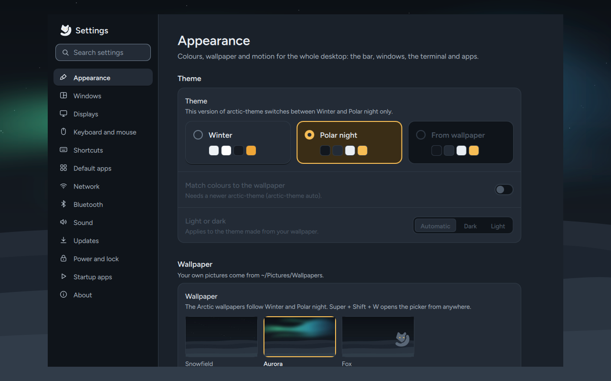

From a terminal:

```sh
arctic-settings              # open it (a second call brings the window forward)
arctic-settings displays     # open it on a page
```

The page names for `arctic-settings <page>` are `appearance`, `windows`, `displays`, `input`,
`shortcuts`, `apps`, `network`, `bluetooth`, `sound`, `updates`, `power`, `startup` and `about`.

## Finding a setting

Type in the search box at the top of the page list (or press `Ctrl + F` or `/`, or just start
typing in the list). The search covers every setting on every page; pick a result and Settings
opens its page and highlights the row.

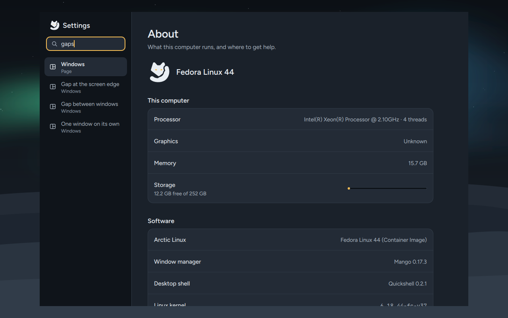

| Key | Does |
|---|---|
| `Ctrl + F` or `/` | Search every setting |
| `↑` / `↓` in the page list | Switch pages |
| `Tab` | Go into the page |
| `Esc` | Back to the page list |
| `Ctrl + Page Up` / `Page Down` | Previous / next page, from anywhere |
| `Ctrl + Z` | Undo the last change |
| `Ctrl + Q` | Close Settings |

A setting you've changed shows a **Changed** mark and a **Reset** button that puts back Arctic's
value.

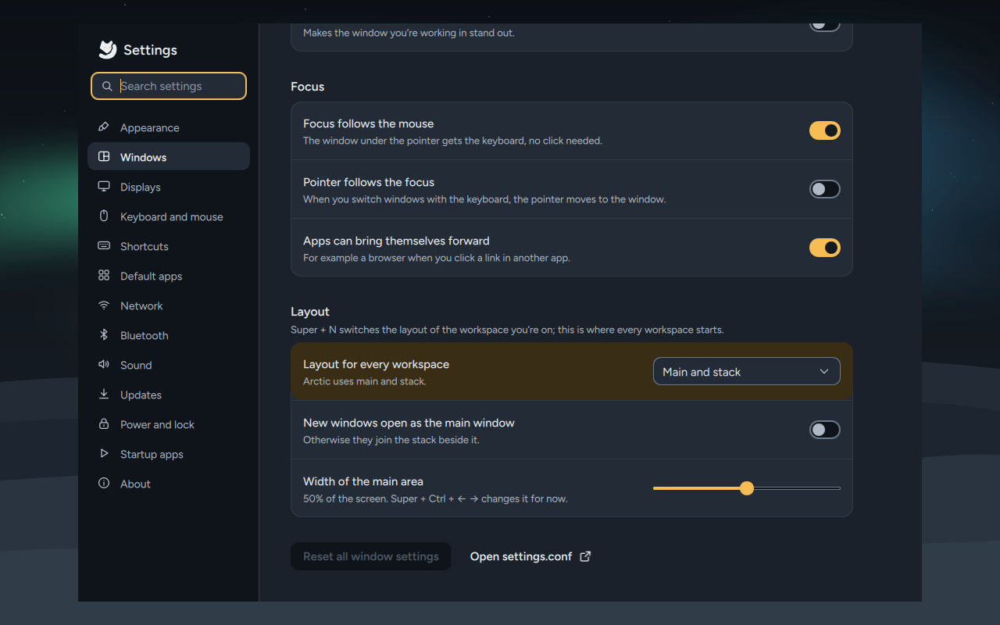

## Where your changes go

Nothing in Settings needs your password: it only writes files in your home folder, and only
through programs that already work without root. Every file is checked before it's saved (window
manager settings with Mango itself), written in one go so it's never half-written, and the
previous version is kept in `~/.local/state/arctic/settings-backups/` (the newest 20 of each
file). That's what `Ctrl + Z` uses.

| Setting | Written to | Applied |
|---|---|---|
| Windows, keyboard, touchpad, mouse, pointer, default layout, your shortcuts, startup apps, kept display layouts | `~/.config/mango/settings.conf` | At once (Mango reloads its configuration); startup apps at the next login |
| Theme, colours from the wallpaper, light or dark | through `arctic-theme set`, `auto`, `mode` | At once |
| Wallpaper | through `arctic-wallpaper` | At once |
| Reduce motion | through `arctic-motion on\|off` | At once |
| Text size in apps, pointer for GTK apps | GNOME's settings (`gsettings`, `org.gnome.desktop.interface`) | New windows |
| Displays | `wlr-randr`; kept layouts as `monitorrule=` lines in `settings.conf` | At once, reverted after 15 seconds unless you keep it |
| Default apps | `~/.config/arctic/default-apps` and `~/.config/mimeapps.list` | At once |
| Lock and suspend times | `~/.config/arctic/idle.conf` | At once |
| Power mode | the power profiles service (tuned-ppd) | At once |
| Wi-Fi on or off | NetworkManager (`nmcli`) | At once |
| Bluetooth, sound | BlueZ and PipeWire directly | At once |
| Updates | through `arctic-update` | At once |

`settings.conf` is read after Arctic's own Mango files and **before** your
`~/.config/mango/user.conf`, so anything you set by hand in `user.conf` still wins. When it does,
Settings says so on the row. If your `~/.config/mango/config.conf` doesn't include
`settings.conf` yet (it was copied before 0.2), Settings adds the line
`source-optional=~/.config/mango/settings.conf` just before the `user.conf` line.

When a program Settings needs is missing, the page says so instead of failing. For example,
without `wlr-randr` the Displays page can change scale, rotation and position but not the
resolution.

## Appearance

Colours, wallpaper and motion for the whole desktop: the bar, windows, the terminal and apps.

- **Theme:** Winter (light), Polar night (dark) or **From wallpaper**, which makes a theme from
  the colours of your picture.
- **Match colours to the wallpaper:** each new wallpaper makes the theme again, so the accent
  always suits the picture. This is the same switch as **Match colours to wallpaper** in the
  wallpaper picker (`Super + Shift + W`).
- **Light or dark:** for the theme made from your wallpaper: Automatic (whatever suits the
  picture), Dark or Light.
- **More themes:** Nord, Catppuccin, Gruvbox, Tokyo Night, Rosé Pine and Everforest, drawn from
  their own colours; a pair (Catppuccin Latte and Mocha) switches as one with `Super + Shift + T`.
- **Icons in the terminal:** whether the Nerd Font symbols yazi, eza and prompts use are
  installed (`arctic-fonts-symbols`), with a way to get them when they aren't.
- **Code font:** the monospace font for the terminals (kitty, foot, alacritty), GTK's monospace
  font and the shell (`arctic-font`); a font you set in a terminal's own file is left alone.
- **Switch light and dark by itself:** Off, Sunset to sunrise (where your time zone is) or Custom
  hours. See [Themes and customisation](Themes-and-Customisation#light-by-day-dark-at-night).
- **Wallpaper:** Arctic's wallpapers and your own pictures from `~/Pictures/Wallpapers` (the same
  list as the wallpaper picker). **Add pictures…** opens the file chooser; you can also drag
  pictures here from Files. Added pictures are copied into `~/Pictures/Wallpapers` (only real
  pictures: JPEG, PNG, WebP, BMP or GIF). Point at one of your own pictures to **rename** or
  **delete** it (or select it and press `F2` or `Delete`). The picture in use can't be deleted.
- **Wallhaven:** search [wallhaven.cc](https://wallhaven.cc) from Settings. Type some words (or
  press **Browse**), choose **Top**, **Latest** or **Random**, the categories and how safe the
  pictures must be (only **Safe** is ticked at first). **Fit my screens** shows only pictures at
  least as large as your largest screen, in your screens' shapes. Click a picture for a larger
  look, then **Download and set**: it's saved in `~/Pictures/Wallpapers/wallhaven` and becomes
  your wallpaper, and with **Match colours to the wallpaper** on, the colours follow it. Nothing
  is downloaded until you search. Without internet the section says so; the rest of Settings
  works as usual. Wallhaven allows 45 searches a minute; Settings waits or tells you when to try
  again.
- **Wallhaven API key** (optional): with the key from your Wallhaven account (Settings → Account),
  searches use your account's filters, and **NSFW** can be ticked. It's kept in
  `~/.config/arctic/wallhaven.json`, which only you can read; **Remove** deletes it.
Reduce motion, text size and the pointer moved to [Accessibility](#accessibility) in 0.3.

See [Themes and customisation](Themes-and-Customisation) for how themes work and `arctic-theme`.

## Windows

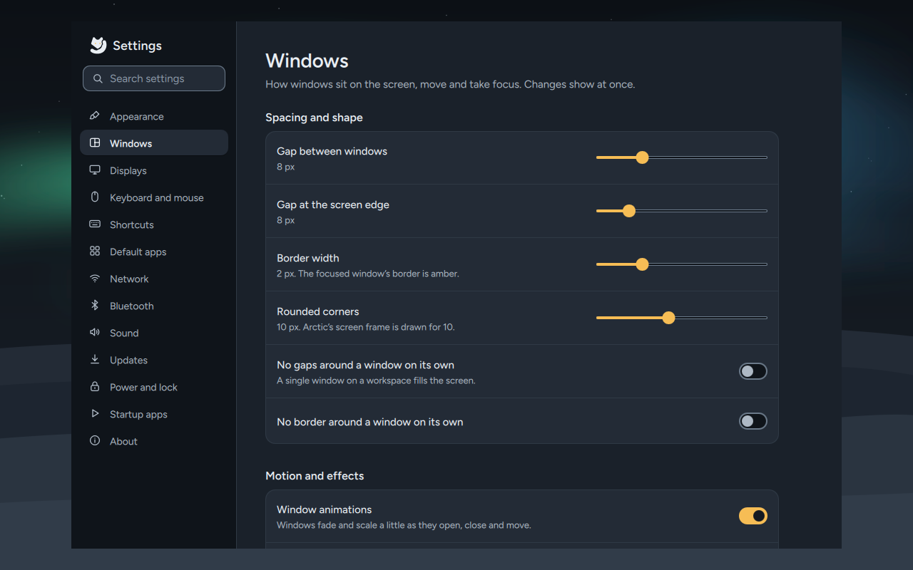

How windows sit on the screen, move and take focus. Changes show at once.

- **Spacing and shape:** the gap between windows and at the screen edge, border width, rounded
  corners, and whether a window on its own gets gaps and a border.
- **Motion and effects:** window animations and their speed, the frosted bar, shadows, and
  dimming the windows you aren't using.
- **Focus:** focus follows the mouse, the pointer follows the focus, and whether apps can bring
  themselves forward (for example a browser when you click a link in another app).
- **Layout:** the layout every workspace starts in (`Super + N` still switches the one you're on),
  whether new windows open as the main window, and the width of the main area.

**Reset all window settings** puts back Arctic's values; **Open settings.conf** shows the file.

## Displays

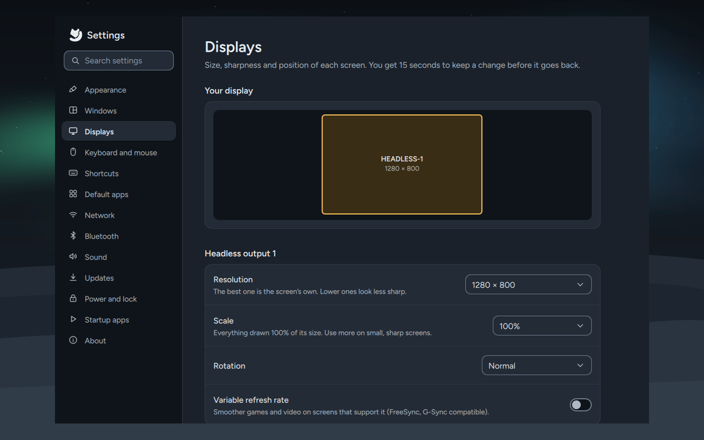

**Arrangement** shows your screens as they sit next to each other, each drawn to scale. Drag one
to where it is on your desk and let go: it snaps against the edge of another screen, and lines up
with its top, bottom or middle when you drop it close to that. Screens always touch along an edge,
because that's where the pointer crosses from one to the next, and they never overlap; a screen
that was only touching the one you moved moves along with it. With the keyboard, press `Tab` until
a screen is highlighted, then use the arrow keys.

Click a screen to change it:

- **Use this display:** switch it off or on. The last screen that's on can't be switched off.
  A screen that's off is listed under the arrangement, so you can pick it and switch it back on.
- **Main display:** the screen you start on when you log in. The pointer, your first windows,
  the launcher and notifications appear there; the bar is on every screen. Arctic's window
  manager starts at the top-left corner of the arrangement, so **Make main** moves the screen
  there: it swaps places with the screen that was there. Dragging another screen to the far left
  or top makes that one the main display instead, and the **Main** label moves with it.
- **Resolution** and **Refresh rate.**
- **Scale:** how big everything is drawn. The row says how large the desktop is at that scale,
  for example a 2560 × 1600 screen at 150% gives a 1706 × 1066 desktop.
- **Rotation:** portrait (90° or 270°), upside down, or mirrored.
- **Variable refresh rate** for screens with FreeSync or G-Sync.

If your screens overlap or have a gap between them when you open the page, Settings shows them
lined up and says so; press **Apply** to use that.

Press **Apply** and the change happens at once, with a question: **Keep these display
settings?** If you don't press **Keep changes** within 15 seconds (for example because the screen
went black), the old layout comes back by itself. If Settings has closed in the meantime, a
watchdog puts it back after 20 seconds. A kept layout is
saved as `monitorrule` lines in `settings.conf`, listed under **Saved layout**; **Forget** removes
it.

Settings remembers one place per screen. If you use a laptop with different monitors, say at home
and at work, each monitor keeps the place you last kept for it, unless that would put it on top of
the layout you kept since; then it comes back to the right of your other screens, and you can
drag it where you want once more.

A display you switch off stays off only until you log out. That's on purpose: a saved "off" could
leave a laptop's only screen dark the next time it starts without its dock.

## Keyboard and mouse

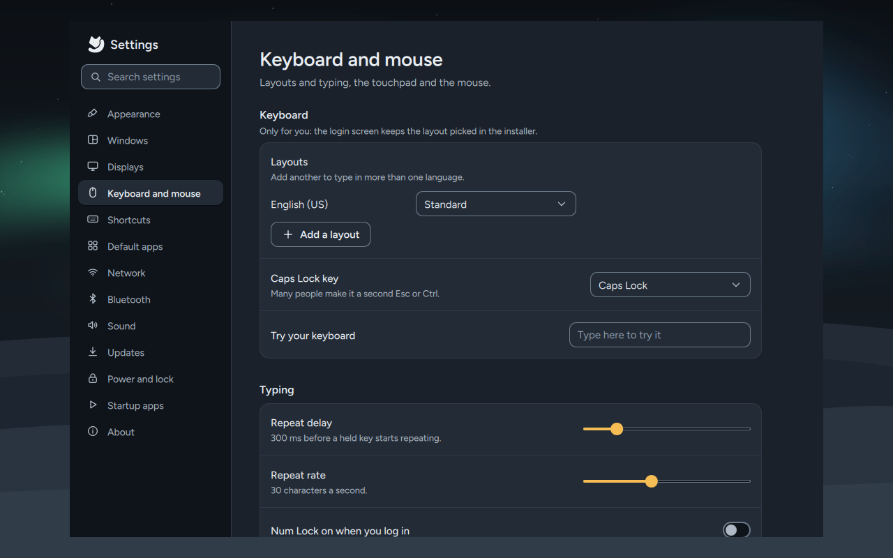

- **Keyboard:** your layouts (**Add a layout**), the keys that switch between them, what the
  Caps Lock key does (many people make it a second Esc or Ctrl), and a box to try your keyboard.
- **Typing:** repeat delay and rate, and Num Lock on when you log in.
- **Touchpad:** tap to click, tap and drag, natural scrolling, turning the touchpad off while
  typing, pointer speed and acceleration, scrolling speed, right click, middle click with both
  buttons, and turning the touchpad off altogether.
- **Mouse:** pointer speed and acceleration, natural scrolling, scrolling speed and left-handed.

## Shortcuts

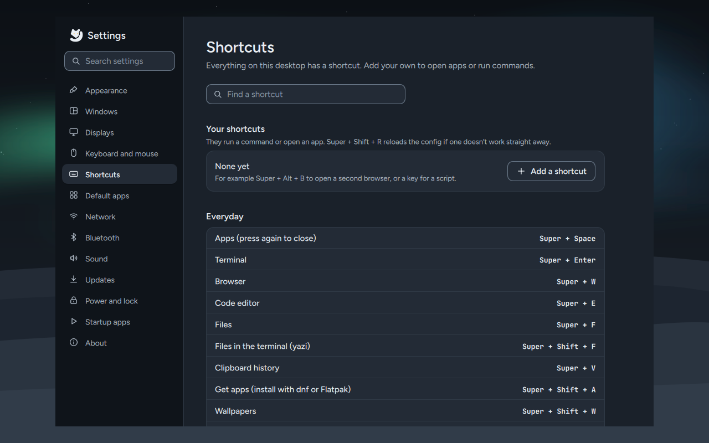

Every shortcut of the desktop, searchable, and **Your shortcuts**. **Add a shortcut**: click the
key box and press the keys, then type a command or pick an app to open. Mango uses the first
shortcut it finds for a key, so Settings refuses a key that's already taken. Your shortcuts are
saved as `bind=` lines in `settings.conf`.

**Every shortcut in your Mango config** lists everything Mango has, including the ones in your
`user.conf`. The main ones are also on [Keyboard shortcuts](Keyboard-Shortcuts).

## Default apps

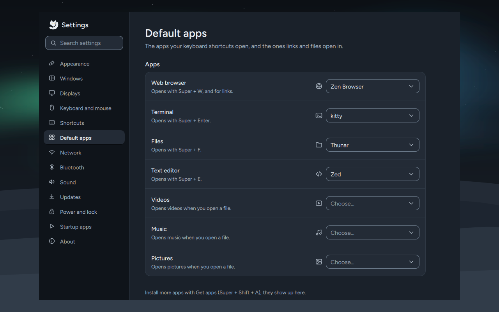

The apps your keyboard shortcuts open, and the ones links and files open in: Web browser
(`Super + W`), Terminal (`Super + Enter`), Files (`Super + F`), Text editor (`Super + E`), Videos,
Music, Pictures and PDF documents. The first four are saved in `~/.config/arctic/default-apps`
(read by `arctic-open`), and every one also in `~/.config/mimeapps.list`, as `xdg-mime default`
would. **Get apps** installs more; they show up here.

- **Web search:** the engine for the launcher's last row and for `?` searches (DuckDuckGo,
  Startpage, Brave Search, Ecosia, Google or Bing). Saved in `~/.config/arctic/shell.json`
  (`webSearch`; your own `https://…%s…` address works there too).

## Network

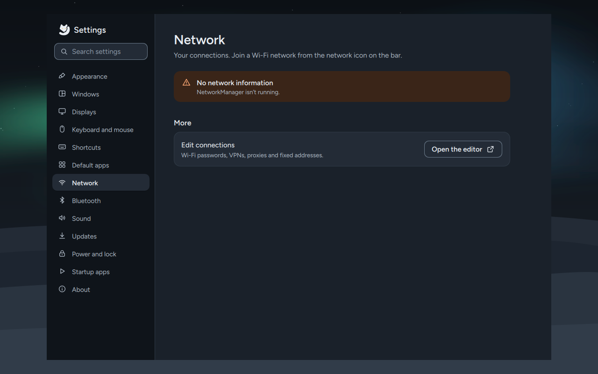

Your connections and a Wi-Fi switch. Join a Wi-Fi network from the network icon on the bar.
**Open the editor** starts the connection editor (`nm-connection-editor`) for VPNs, proxies and
fixed addresses; **Open nmtui** lists the Wi-Fi networks around you in a terminal.

## Bluetooth

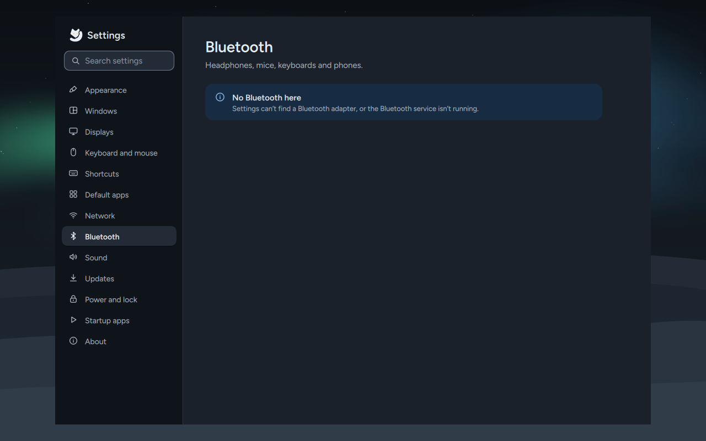

Bluetooth on or off, and your devices, with **Connect**, **Disconnect** and **Forget**. **Pair a
device** opens the Bluetooth manager (`blueman-manager`), which also asks for pairing codes. On a
computer without a Bluetooth adapter the page says so.

## Sound

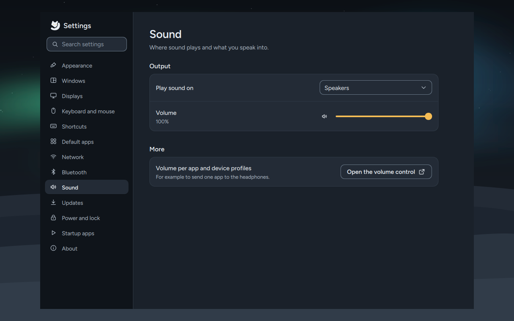

Where sound plays (**Play sound on**) and its volume, and which microphone you speak into and its
volume. **Open the volume control** starts the full mixer, for the volume of each app and device
profiles.

## Updates

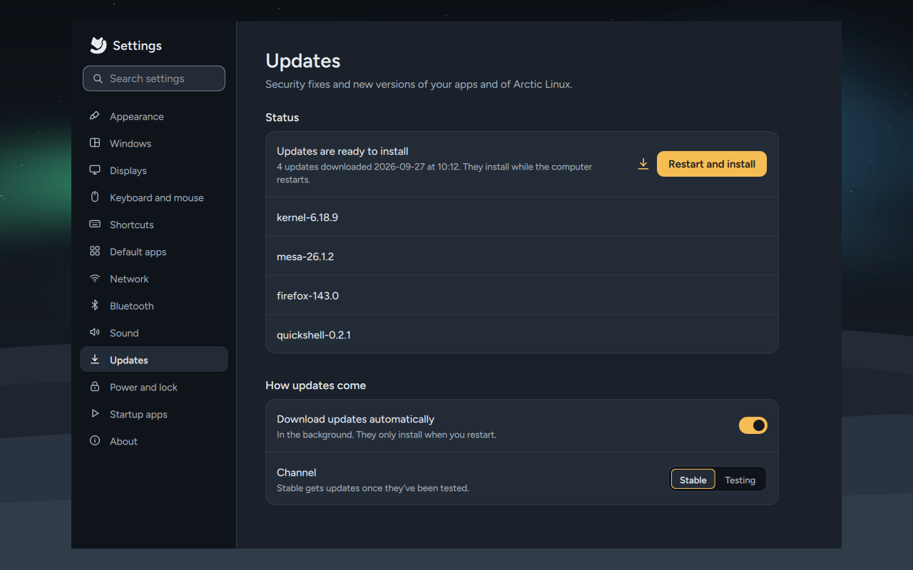

What's waiting, **Check now**, and **Restart and install** when updates have been downloaded.
Under **How updates come**: **Download updates automatically** (in the background; they only
install when you restart) and the **Channel**, Stable or Testing. These are the same as
`arctic-update auto on|off` and `arctic-update channel stable|testing`; see [Updates](Updates).

## Power and lock

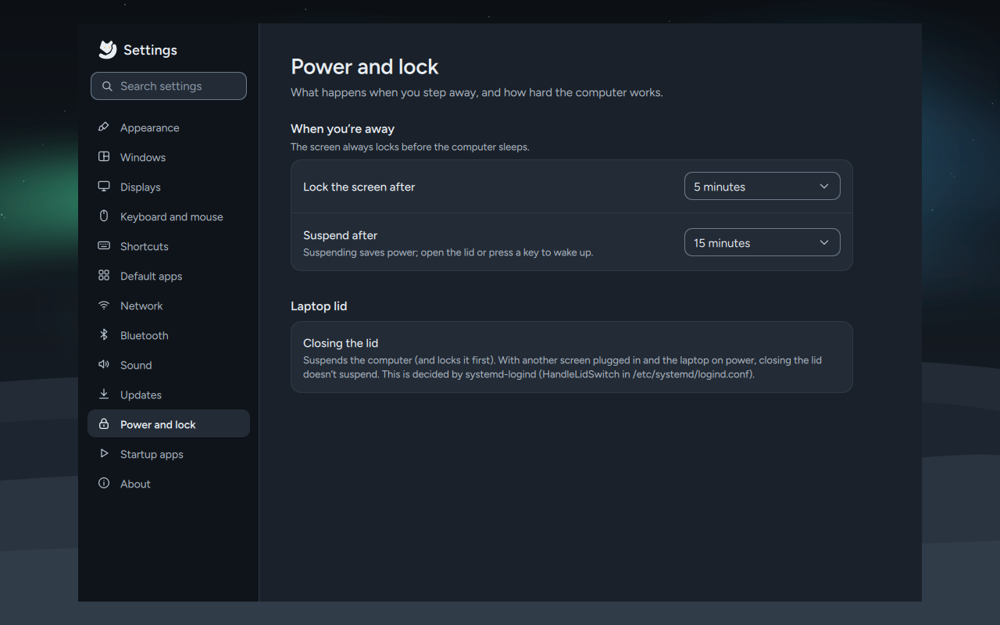

- **When you're away:** lock the screen after, and suspend after, a time you pick (or never).
  The screen always locks before the computer sleeps. Saved in `~/.config/arctic/idle.conf`.
- **Power mode:** Power saver, Balanced or Performance (when the computer offers them).
- **Laptop lid:** closing the lid suspends the computer, and locks it first. With another screen
  plugged in and the laptop on power, it doesn't suspend. That's decided by systemd-logind
  (`HandleLidSwitch` in `/etc/systemd/logind.conf`), not by Settings.

The live session never locks or suspends on its own; these settings apply once Arctic Linux is
installed.

## Accessibility

Bigger, calmer and easier to reach from the keyboard.

- **High contrast:** stronger text, lines and focus rings in whatever theme you use, the bar and
  apps too (see [High contrast](Themes-and-Customisation#high-contrast)).
- **Text size in apps:** 100% to 200% for GTK apps such as Files and most dialogs, and the
  terminals too (10.5 pt at 100%, 13 pt at 125%, through `arctic-font size`). The bar and menus
  keep their size.
- **Pointer size** (Normal, Large, Larger) and **Pointer style** (the cursor themes installed).
- **Reduce motion:** windows and menus fade instead of moving, and the fox in the terminal stays
  still.
- **Keyboard pointer** (`Super + Alt + K`): labels appear on the screen; type one to move the
  pointer there, narrow it down if you like, then click with the keyboard. The key again closes
  it. It needs `wl-kbptr` (Arctic installs it; **Get it** opens Get apps when it's missing).
- **Not available yet:** a screen reader (Orca doesn't get the keyboard access it needs on
  compositors like Mango), a magnifier (Mango has none) and an on-screen keyboard (none that works
  here is packaged for Fedora 44). The page says so rather than hiding it.

## Startup apps

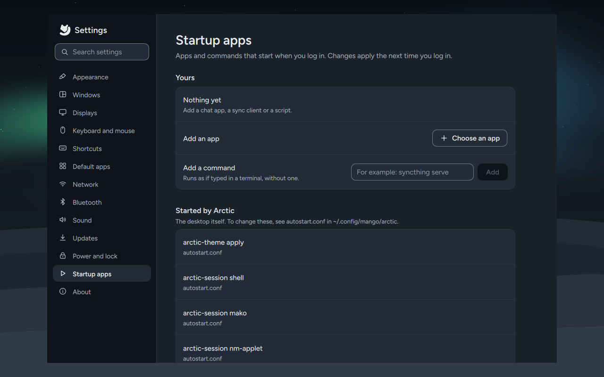

Apps and commands that start when you log in: **Add an app** (pick one) or **Add a command**.
They're saved as `exec-once=` lines in `settings.conf` and start from the next login. **Started
by Arctic** lists what the desktop itself starts; those live in `autostart.conf` in
`~/.config/mango/arctic`.

## About

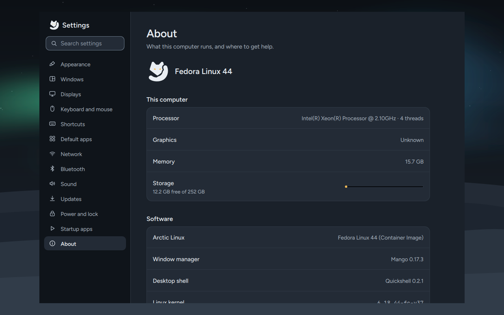

Which Arctic Linux and Fedora you run, the computer's model, processor, graphics, memory and
storage, and the versions of the window manager, shell and kernel. **Open the wiki** comes here,
and **Report a problem** has **Copy details** (a summary of the above to paste into an issue) and
**Open issues**.

## If Settings won't open

Run it in a terminal to see its messages:

```sh
arctic-settings
```

To undo a change that made the desktop unusable, open a terminal (`Super + Enter`) and move the
file away, then reload Mango (`Super + Shift + R`):

```sh
mv ~/.config/mango/settings.conf ~/.config/mango/settings.conf.off
```

The earlier versions are in `~/.local/state/arctic/settings-backups/`.
