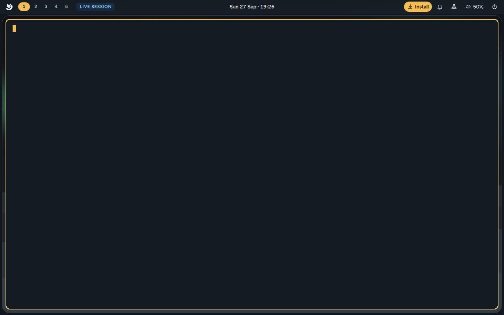

# Terminal and shell

`Super + Enter` opens a terminal. Out of the box that's **kitty** running **zsh**, and a small
block-drawn fox says hello.



## The fox greeting: `arctic-fetch`

Each new terminal starts with `arctic-fetch`: the Arctic fox beside a short summary of your
system.

- **The fox** blinks, twitches an ear and flicks its tail, plays that twice, then rests. Its eyes
  are amber. Press any key to skip straight to the resting fox.
- **Next to it:** `you@your-computer`, then `os`, `base` (the Fedora release underneath),
  `kernel`, `wm` (Mango on Wayland), `shell`, `term`, `theme` and `uptime`, and two rows of colour
  swatches showing the terminal's palette. fastfetch finds these (the same as
  [`fastfetch`](#fastfetch-and-neofetch) shows); without fastfetch the greeting finds them itself.
- Colours come from the terminal's palette, so the greeting follows the theme.

Some ways to change it:

```sh
arctic-fetch            # show it again
arctic-fetch --static   # the resting fox, no animation
```

- It's drawn still (no animation) when reduced motion is on (`arctic-motion off`), when
  `ARCTIC_REDUCE_MOTION=1` is set, or when the window is too narrow for it (under 60 columns, or
  narrower than the fox and its longest line).
- To turn the greeting off, see [Turning the greeting off](#turning-the-greeting-off) below.
- **Fetch** in the launcher (`Super + Space`) opens a terminal with the greeting.
- The lines beside the fox are a fastfetch layout: copy
  `/usr/share/arctic/fastfetch/greeting.jsonc` to `~/.local/share/arctic/fastfetch/greeting.jsonc`
  and edit it to change them.

### Turning the greeting off

`~/.zshrc` runs the greeting before it reads `~/.zshrc.local`, so the setting has to come earlier.
Add this line to `~/.zprofile` (read once when you log in, and passed on to every terminal), then
log out and back in:

```sh
export ARCTIC_FETCH=0
```

## fastfetch and neofetch

`fastfetch` prints a fuller report beside a bigger fox (the Arctic mark in block characters,
with amber eyes). On a laptop, for example:

```text
you@your-computer
────────────────────
os        Arctic Linux 0.2 (Fedora 44)
kernel    6.17.1-300.fc44.x86_64
uptime    3 h 12 min
packages  12 (flatpak), 1843 (rpm)
shell     zsh 5.9
wm        Mango · Wayland
terminal  kitty 0.42.2
theme     Polar night
cpu       AMD Ryzen 7 7840U (16) @ 5.13 GHz
gpu       AMD Radeon 780M [Integrated]
memory    5.2 GiB / 30.6 GiB (17%)
disk /    41.3 GiB / 475.4 GiB (9%) - btrfs
updates   up to date · checked today
```

- **packages** counts Fedora packages (rpm), Flatpak apps and, once you have some, Nix packages.
- **updates** is what the daily update check last found, as the bar's indicator shows it
  ([Updates](Updates)): for example "12 updates ready (84 MB) · restart to install". fastfetch
  never starts a check, so it stays quick; the line is left out on the live USB.
- The colours follow the theme (Winter, Polar night or your wallpaper's):
  `~/.config/fastfetch/config.jsonc` is a link to the active theme's
  `~/.config/arctic/current/fastfetch/config.jsonc`.

`neofetch` shows the classic neofetch screen: `you@your-computer` over a dashed line, then OS,
Host, Kernel, Uptime, Packages, Shell, Resolution, DE, WM, WM Theme, Theme, Icons, Terminal,
Terminal Font, CPU, GPU and Memory, and the colour blocks, with the fox on the left. neofetch
itself is no longer developed and Fedora doesn't ship it, so Arctic's `neofetch` is fastfetch with
neofetch's layout. `neofetch --stdout` prints it without the fox and colours; fastfetch's options
work too (`neofetch --logo none`). If you install the real neofetch (from Nix or a COPR, say),
`neofetch` runs that instead.

### Changing them

- **fastfetch:** replace the link with a copy of the theme's layout and edit that:

  ```sh
  cp --remove-destination ~/.config/arctic/current/fastfetch/config.jsonc ~/.config/fastfetch/config.jsonc
  ```

  A copy keeps the colours of the theme it came from. To follow the theme again:
  `ln -sfn ../arctic/current/fastfetch/config.jsonc ~/.config/fastfetch/config.jsonc`.
- **neofetch:** your own `~/.config/fastfetch/neofetch.jsonc` is used instead of the theme's
  (start from a copy of `~/.config/arctic/current/fastfetch/neofetch.jsonc`).
- **The fox** is also in `/usr/share/arctic/fastfetch/logo.txt` for layouts of your own
  (`$1` is the fur, `$2` the eyes):

  ```sh
  fastfetch --file /usr/share/arctic/fastfetch/logo.txt --logo-color-1 white --logo-color-2 yellow
  ```

- The Arctic lines come from `arctic-fetch --info os|base|wm|shell|theme|updates`, which you can
  use in a layout of your own as fastfetch `command` modules.
- fastfetch's options and modules: `fastfetch --help`, `fastfetch --list-modules` and
  [its wiki](https://github.com/fastfetch-cli/fastfetch/wiki/Configuration).

## kitty

Arctic's kitty is set up to match the desktop:

- **JetBrains Mono** at 10.5 pt, with ligatures off under the cursor.
- An **amber block cursor** that doesn't blink.
- Comfortable padding and no title bar; Mango draws the rounded border.
- Rounded tabs at the bottom, with the active tab in bold.
- **Copy on select**: selecting text copies it to the clipboard.
- No bell sound.

The colours come from the active theme (`~/.config/arctic/current/kitty.conf`) and change when you
press `Super + Shift + T`, even in terminals that are already open.

Your own kitty settings go in `~/.config/kitty/user.conf`. It's read last, so anything there wins,
and Arctic never overwrites it:

```ini
font_size 12
background_opacity 0.95
```

### The code font

Settings › Appearance › **Code font** (or the [command menu](Command-Menu)'s Style › Code font)
picks any monospace font installed. `arctic-font` changes it in kitty (which reloads), foot, and
alacritty, sets GTK's monospace font, and the shell's own code text follows. It only changes a
line that still holds what Arctic wrote there, so a font you set yourself stays, and it says so:

```sh
arctic-font list                 # monospace fonts installed
arctic-font set "Fira Code"
arctic-font size 12              # the terminals' size (arctic-font size reset: 10.5)
```

### Icons in the terminal

yazi, `eza --icons` and many prompts draw icons from the Nerd Font symbols. Arctic installs them
(the `arctic-fonts-symbols` package: Nerd Fonts' "Symbols Only" fonts) and puts them after the code
font, so whichever code font you pick, letters come from it and the icons from the symbols; you
don't need a patched "Nerd Font". Settings › Appearance › **Icons in the terminal** says whether
they are installed. A patched Nerd Font you install yourself shows up in the code font list too.

kitty's own shortcuts work as usual; for example `Ctrl + Shift + T` opens a new tab and
`Ctrl + Shift + Enter` a new window inside kitty. See kitty's documentation for the full list.

## zsh

zsh is the default shell. Arctic's `~/.zshrc` gives you:

- **The prompt**: `~/projects ❯`. The folder is green, the Git branch (inside a Git repository)
  is shown dimmed after it, and the arrow is amber, turning red after a command fails.
- **History**: 50,000 lines, shared between open terminals, without the same command twice in a
  row. Commands that start with a space aren't saved. It's kept in `~/.local/state/zsh/history`.
- **Search history with the arrows**: type the start of a command, then `↑` / `↓` to go through
  earlier commands that start the same way.
- **Completion** with a menu you can move through, ignoring upper and lower case.
- **Moving around**: type a folder's name to go into it; `Ctrl + ←` / `→` jumps a word;
  `Home` / `End` go to the start and end of the line.
- **Aliases**: `ll` (long list), `la` (long list with hidden files), `y` (yazi), and coloured `ls`
  and `grep`.
- `~/.local/bin` is on your `PATH`, for your own scripts.
- `EDITOR` is `nano` unless you set it.

Add your own settings to `~/.zshrc.local`; Arctic never touches it:

```sh
export EDITOR=nvim
alias gs='git status'
```

## bash and fish

**bash** is always installed. If you picked it as your shell, you get the same `~/projects ❯`
prompt and the same `ls` aliases (from `~/.bashrc.d/arctic.sh`). The fox greeting is zsh only;
run `arctic-fetch` whenever you like.

**fish** uses its own prompt and settings.

To change your login shell later (log out and back in afterwards):

```sh
sudo usermod --shell /usr/bin/fish "$USER"     # fish
sudo usermod --shell /bin/zsh "$USER"          # zsh
sudo usermod --shell /bin/bash "$USER"         # bash
```

Install fish first with `sudo dnf install fish` if you didn't pick it in the installer.

## Other terminals

If you picked another terminal in the installer (**Ghostty**, **Alacritty**, **foot** or
**Konsole**), `Super + Enter` opens that instead. foot and Alacritty get Arctic's colours too (in
new windows after a theme change); Ghostty and Konsole start with their own look. To switch
which terminal `Super + Enter` opens, see
[Themes and customisation](Themes-and-Customisation#default-apps).

## yazi

`Super + Shift + F` (or `y` in the terminal) opens **yazi**, a quick file manager inside the
terminal. Arrow keys move around, `Enter` opens, and `q` quits.
