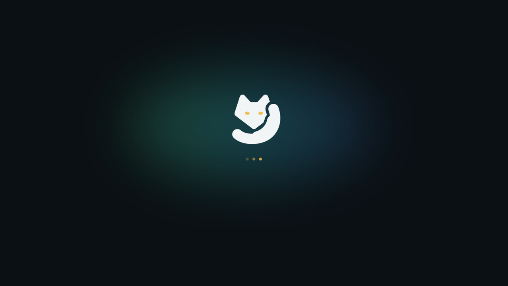
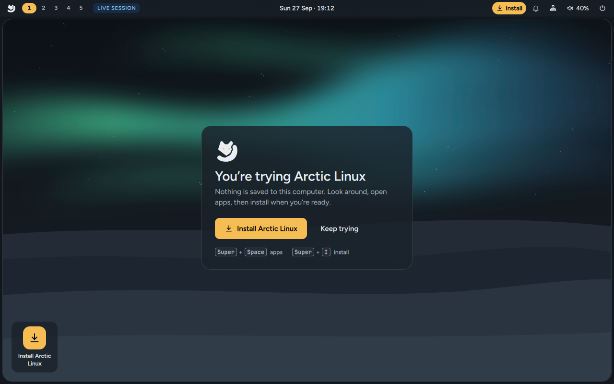
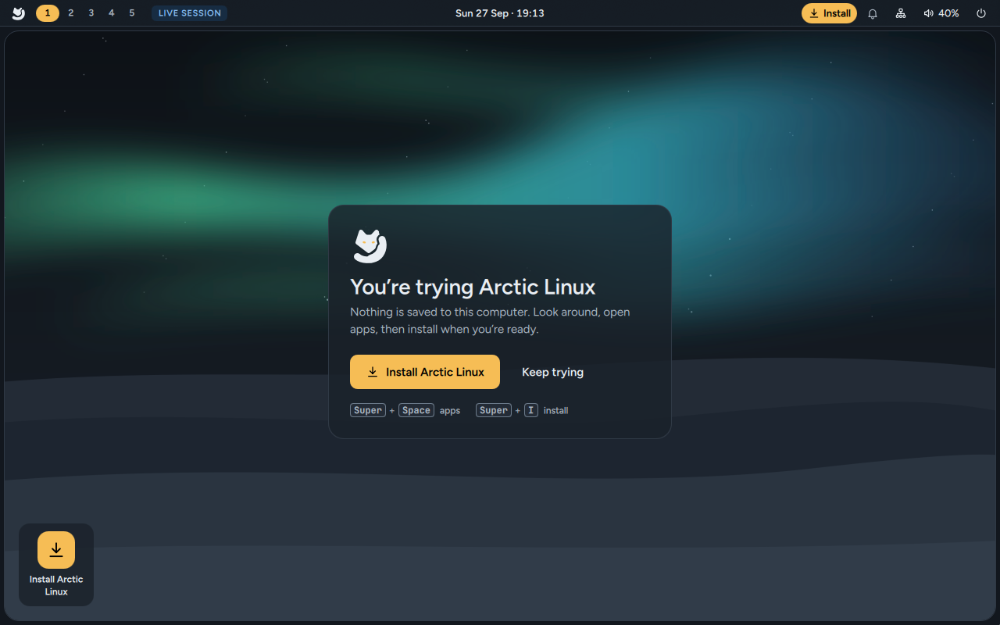
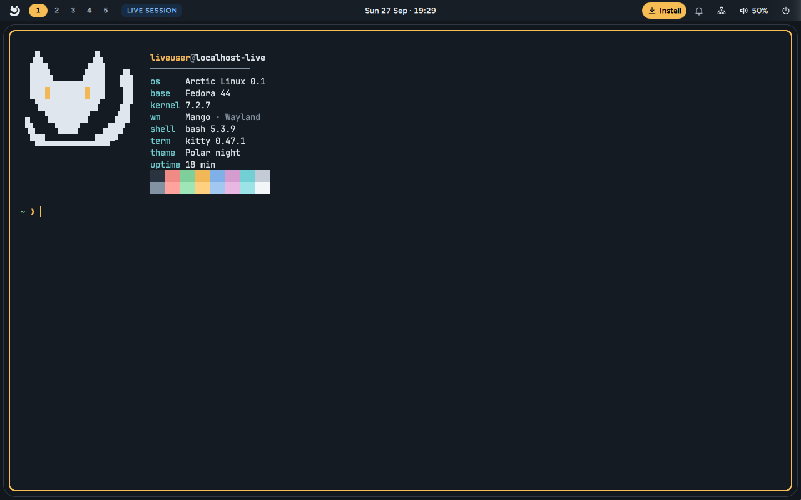

# Try Arctic Linux

**Try Arctic Linux** runs the whole desktop from the USB stick. Nothing is written to your
computer's disks, so it's a safe way to see whether you like Arctic Linux and whether your
Wi-Fi, sound and screen work. It's the first entry in the [boot menu](Download-and-Create-a-USB#the-boot-menu)
and starts by itself after 5 seconds.

## Starting up

While Arctic Linux starts, the fox breathes slowly and three amber dots pulse. Starting from a USB
stick takes a little longer than starting from an internal disk. You're logged in automatically;
there's no password in the live session.

## The welcome card

The first thing you see is a card that says **You're trying Arctic Linux**: *"Nothing is saved to
this computer. Look around, open apps, then install when you're ready."*

- **Install Arctic Linux** opens the installer.
- **Keep trying** closes the card so you can look around.

The card shows once each time you start from the USB stick. The top bar also shows a
**Live session** tag, so you always know you're not on an installed system.

## Look around

Everything works as it will after you install. A few things to try:

| Press | To |
|---|---|
| `Super + Space` | Open the launcher and search for apps. Type `=12*4` to use it as a calculator. |
| `Super + Enter` | Open a terminal and see the fox greeting |
| `Super + F` | Open Nautilus (GNOME Files) |
| `Super + Shift + W` | Pick a wallpaper |
| `Super + Shift + T` | Switch between the Polar night and Winter themes |
| `Super + /` | See every keyboard shortcut |

`Super` is the key with the Windows logo on most keyboards. The [desktop tour](Desktop-Tour)
explains the rest.

### A browser in the live session

Some builds of the live USB include **Zen Browser**, so you can go online straight away
(`Super + B`). The release notes on the download page mention it when yours does; the ISO
build leaves Zen out when including it would make the image larger than 2 GB.

If your copy has no browser, you can add one for this session with **Get apps**
(`Super + Shift + A`) → **Flathub apps** or **Fedora packages**: type `firefox` and press `Enter`.
It's gone again when you restart.

## What's different from an installed system

- **Nothing is kept.** Files you save, apps you add and settings you change are lost when you
  restart or shut down.
- **No password.** The live user has no password and can use `sudo` without one.
- **No lock screen.** `Super + L` only tells you that locking is off, and the screen never locks
  by itself.
- **The power menu** (`Super + Esc`) offers only **Settings**, **Restart** and **Shut down**.
- It can feel slower than an installed system, because everything is read from the USB stick.

## When you're ready to install

Any of these opens the installer:

- **Install Arctic Linux** on the welcome card
- **Install** (amber) on the right of the top bar
- the **Install Arctic Linux** tile in the bottom-left corner of the desktop
- **Install Arctic Linux** in the launcher (`Super + Space`)
- `Super + I` from anywhere

Only one installer runs at a time; opening it again while it's open does nothing. If you quit the
installer before it starts installing (`Esc`), you're back on the live desktop.

You can also restart and choose **Install Arctic Linux** in the boot menu, which opens the
installer full screen as soon as the desktop starts.

Next: [Install Arctic Linux](Install-Arctic-Linux).
