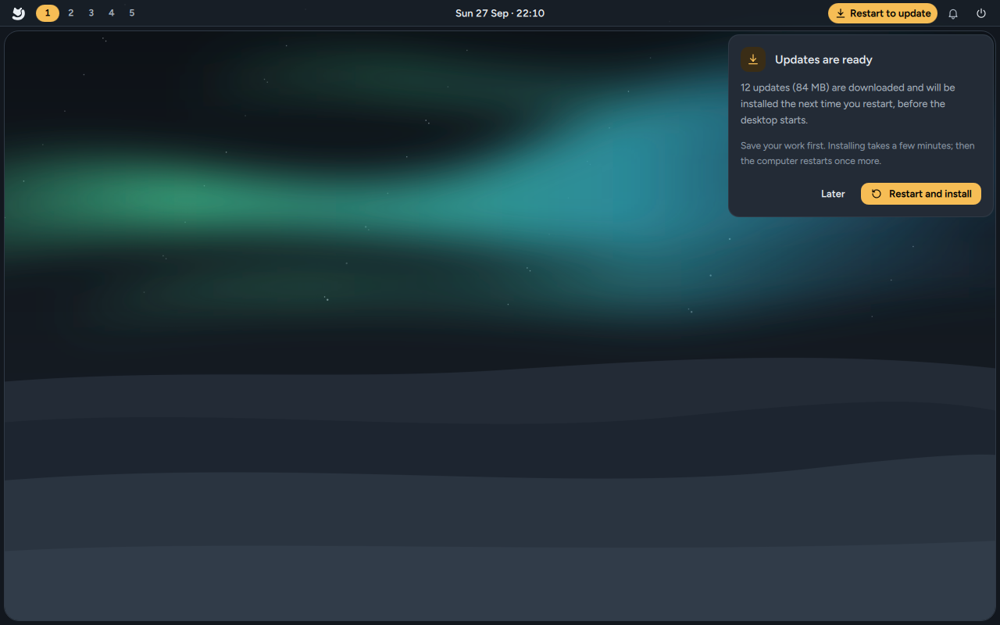

# Updates

Arctic Linux keeps itself up to date. Once a day it downloads updates in the background, and it
installs them the next time the computer starts, before the desktop appears. Nothing changes
while you work, and it never restarts the computer by itself.



## How updates work

1. **A check every day.** About ten minutes after the computer starts, and once a day after
   that, Arctic Linux looks for updates to everything installed with dnf: Fedora's packages,
   Arctic's own (the desktop, the shell, Mango, the installer's apps), RPM Fusion and any other
   repository you added. Flatpak and Nix apps update separately (see
   [below](#flatpak-and-nix-apps)).
2. **Downloaded in the background.** The updates are downloaded at the lowest priority and
   tested: dnf checks that they install cleanly, without installing anything yet. Your running
   system isn't touched.
3. **Ready.** The bar shows **Restart to update**, and a notification says so once.
4. **Installed at the next start.** The next time the computer starts (a restart, or when you
   switch it on again after shutting down), it installs the updates before the desktop appears,
   then restarts once more into the updated system. The boot screen stays up while it works;
   press `Esc` to see the progress as text. Don't switch the computer off during this.

Updates are never installed into the running desktop, so an update can't break the apps you
have open. On the live USB nothing is downloaded: nothing there survives a restart.

## The bar

| You see | It means |
|---|---|
| **Restart to update** (amber, on the right of the bar) | Updates are downloaded and will be installed the next time the computer starts. Hover for how many; click for the card. |
| Nothing | No updates are waiting. |

The card says how many updates there are and how big they are. **Restart and install** restarts
now (save your work first); **Later** closes the card, and the updates wait for your next restart.
`arctic-shell-ipc updates toggle` opens the card from a key binding.

If you install or remove software after the updates were downloaded (with `dnf` or Get apps),
they no longer fit the system exactly, so they aren't installed and the item disappears. The
next daily check prepares them again, reusing what it already downloaded; `arctic-update now`
does it right away.

## The `arctic-update` command

Everything the daily check does, from a terminal. Commands that change something ask for your
password.

| Command | Does |
|---|---|
| `arctic-update` | Shows the channel, automatic updates, the last check and what's waiting |
| `arctic-update status --json` | The same as JSON, for scripts |
| `arctic-update now` | Checks and downloads now, with progress. The updates are installed at the next restart. |
| `arctic-update now --sync` | The same, and also moves packages back to your channel's own builds (after leaving testing) |
| `arctic-update apply` | Restarts now and installs the waiting updates (asks first; `--yes` doesn't) |
| `arctic-update channel` | Shows the channel; `channel stable` or `channel testing` switches |
| `arctic-update auto` | Shows automatic updates; `auto on`, `auto download-only` or `auto off` changes them |
| `arctic-update metered` | Shows what happens on metered connections; `metered skip` or `metered allow` changes it |
| `arctic-update help` | The list of commands |

```text
$ arctic-update
Channel     stable (released builds)
Automatic   on: downloads in the background, installs at the next restart
Metered     no downloads on metered connections
Last check  Sun 27 Sep 2026 06:12
Waiting     12 updates (84.3 MB), installed the next time you restart
```

`dnf upgrade` still works as always, but it installs into the running system; `arctic-update
now` is the gentler way.

## Channels

Arctic's own packages come in two channels. Fedora's packages come from Fedora's repositories on
both.

| Channel | Builds | For |
|---|---|---|
| **stable** (the default) | Released versions, from the `main` branch | Everyday use |
| **testing** | Development builds, published on every push to the development branch | Trying new things first, and helping find problems before a release. They can break. |

```sh
arctic-update channel testing    # testing builds on top of stable
arctic-update now                # get them now (installed at the next restart)
```

Switching back:

```sh
arctic-update channel stable
```

Packages you already updated from testing are newer than the stable ones, so they stay until a
newer stable build replaces them, usually at the next release. To go back to the stable builds
right away:

```sh
arctic-update now --sync         # installed at the next restart
```

Switching channels drops updates that were downloaded but not installed yet; the next check
downloads the right ones.

## Turning automatic updates off

```sh
arctic-update auto download-only   # download in the background, install with arctic-update apply
arctic-update auto off             # no daily check; arctic-update now checks by hand
arctic-update auto on              # back to the default
```

The settings live in `/etc/arctic/update.conf`, which you can also edit (`AUTO=` and
`METERED=`); the next check reads them. `journalctl -u arctic-update-stage` shows what each
check did.

## Metered connections

On a metered connection (a phone hotspot, a plan with a data cap) the daily check waits for a
connection that isn't metered. NetworkManager guesses which connections are metered (phone
hotspots usually are); you can say so yourself:

```sh
nmcli connection show                                  # the connection names
nmcli connection modify "Phone hotspot" connection.metered yes
```

To download updates on metered connections too:

```sh
arctic-update metered allow
```

`arctic-update now` always downloads, because you asked (it tells you when the connection is
metered).

## Undoing an update

Updates rarely go wrong, but when one does, there are several ways back. Try them in this order.

### Undo it with dnf

dnf remembers every transaction, including the updates installed at a restart:

```sh
dnf history list                  # the most recent first; note the ID
dnf history info 42               # what transaction 42 changed
sudo dnf history undo 42          # put the previous versions back
```

This needs the previous versions to still be available for download. Fedora keeps only the
newest update of each package, so for Fedora's packages it doesn't always work; the next ways
do.

### Start the previous kernel

If the computer doesn't start properly after an update that brought a new kernel, restart and
pick the entry with the older version number in the boot menu (it shows for 5 seconds). The last
three kernels are kept.

### Snapshots

Arctic Linux takes a snapshot of the system (a snapper snapshot of the root file system, `/`)
right before and right after every dnf transaction, including the updates installed at a
restart. The ten newest snapshots are kept (the last five transactions; `NUMBER_LIMIT` in
`/etc/snapper/configs/root`), older ones are deleted every hour. Your home folder is not part of
them, and neither are `/var/log` and `/nix`: they are separate subvolumes, so going back never
loses your files.

```sh
snapper -c root list                           # the pairs: pre and post, with the dnf command
snapper -c root status 41..42                  # which files changed between snapshot 41 and 42
snapper -c root diff 41..42 /etc/some.conf     # how one file changed
sudo snapper -c root undochange 41..42         # put every changed file back as it was in 41
```

After `undochange`, restart. It restores files, not the list of installed packages that dnf
shows, so prefer `dnf history undo` when it works; use `undochange` when dnf itself is broken, or
to get back one configuration file (`undochange 41..42 /etc/some.conf`). Administrators (the
account you made in the installer) can run `snapper -c root list`, `status` and `diff` without
`sudo`.

**Btrfs Assistant** shows the same snapshots in a window: browse them, compare files and restore
them. Tick it under **Extras** in the installer, or install it with `sudo dnf install
btrfs-assistant`.

The boot menu can't start the computer from a snapshot: snapshots are for putting files back
from a running system (or from the live USB, with the disk opened there). To get back a system
that doesn't start, start the previous kernel, or start the live USB and restore from there.

Installed with Arctic Linux 0.1? Its installer didn't set up snapshots. Once your system has the
updated Arctic packages, turn them on:

```sh
sudo snapper -c root create-config /
sudo snapper -c root set-config NUMBER_LIMIT=10 NUMBER_LIMIT_IMPORTANT=5 TIMELINE_CREATE=no ALLOW_GROUPS=wheel SYNC_ACL=yes
```

## Flatpak and Nix apps

Apps from Flathub and Nix aren't part of these updates. Update them yourself:

```sh
flatpak update                  # Flatpak apps (Zen, Zed, Collabora Office and others)
nix profile upgrade --all       # Nix packages in your profile
```

## Fixing it on the go

For developers: when something in Arctic Linux itself bothers you, you can fix it on the machine
you're using and send the fix upstream.

**Get the source:**

```sh
git clone https://github.com/yuvalkolodkingal/O-Tism ~/src/O-Tism
```

**The shell** (bar, launcher, popovers) is QML that runs straight from the checkout. Stop the
installed one and run yours; its messages appear in the terminal:

```sh
arctic-shell --stop
quickshell -p ~/src/O-Tism/shell
```

Save a file and restart it (`Ctrl + C`, then the same command) to see the change. `arctic-shell`
starts the installed shell again; `ARCTIC_SHELL_DIR=~/src/O-Tism/shell arctic-shell --restart`
makes it use yours in the background. See the shell's
[README](https://github.com/yuvalkolodkingal/O-Tism/tree/main/shell) for the tests.

**Mango** (windows, shortcuts, gaps): put your settings in `~/.config/mango/user.conf` and press
`Super + Shift + R` to reload. See [Themes and customisation](Themes-and-Customisation#mango-settings-in-userconf).

**The packages:** build them from your checkout (uncommitted changes included) and install the
ones you have:

```sh
cd ~/src/O-Tism
tools/build-rpms.sh                           # → out/repo, in a Fedora container
sudo dnf upgrade ./out/repo/*.rpm             # installs newer versions of the packages you have
```

This installs into the running system, like any `dnf upgrade`: restart the shell or log out and
back in to see the change. A build with the same version as the installed package needs
`sudo dnf reinstall ./out/repo/<package>.rpm` instead. Local builds aren't signed, and the next
update from the channel replaces them. See [Building from source](Building-from-Source).

**Share it:** switch to the testing channel (`arctic-update channel testing`) to run the latest
development builds, and send your change as a pull request. Every push to the development branch
publishes a testing build, so once it's merged, every testing machine gets it at its next check.
