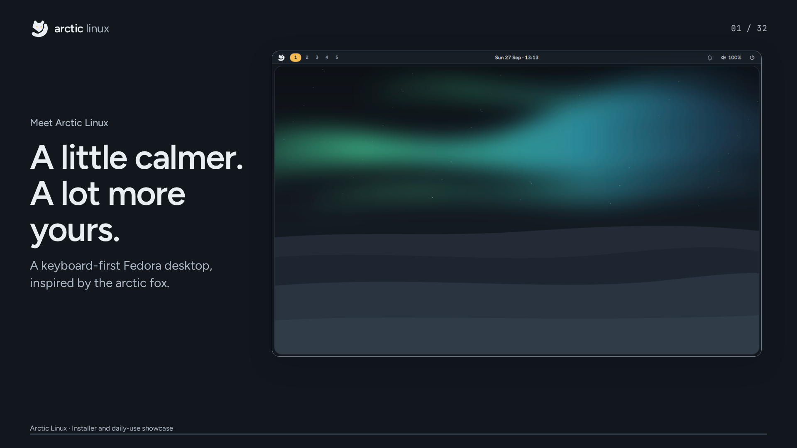

# Arctic Linux showcase

A 6 minute 47 second, 1920 × 1080 showcase made with HyperFrames. It walks through the live USB, every installer step, daily desktop use, personalisation, connectivity, displays, shortcuts, updates, and screen locking. Narration uses Kokoro's `af_heart` voice at its natural speed, with embedded sentence-aligned captions and separate SRT/VTT files.

[Download the video, captions, and editable source](https://github.com/yuvalkolodkingal/Arctic-Linux/releases/tag/showcase-2026-10-03).

[](https://github.com/yuvalkolodkingal/Arctic-Linux/releases/download/showcase-2026-10-03/Arctic-Linux-Showcase-1080p.mp4)

## What the video shows

The screen images are authentic assets from this repository, using the Arctic brand colors, Figtree, JetBrains Mono, and fox mark. Installer screenshots use demo data; they do not represent an installation performed for this video. Nautilus 50.3 and Kitty running Fish 4.6 were captured as real applications on Fedora 44 with Arctic’s styles. The tiling scene places those separate app captures over the Arctic desktop in HTML. The installer, shell, and Settings screens come from the project’s documented UI previews. The video uses animated screenshots and feature cards, rather than a continuous live screen recording.

`asset-provenance.json` records every source image and any crop. Original screenshots remain unmodified in their existing locations. The Winter scene uses the current shell's wallpaper picker rather than an older screenshot with partially switched themes.

## Preview and render

Node.js 22 or newer, FFmpeg, and a supported Chromium browser are needed. HyperFrames is pinned to 0.8.114 in the npm scripts. Fonts, screen assets, GSAP, and the generated narration are bundled locally; a model download is unnecessary for re-rendering.

```sh
cd showcase
npm run check
npx --yes hyperframes@0.8.114 preview --background
# Open the Studio project URL printed by the command.
# Stop the preview when finished:
npx --yes hyperframes@0.8.114 preview --stop
npm run render -- --output renders/Arctic-Linux-Showcase-1080p.mp4 --quality high --fps 30
python finalize-video.py
```

On a cloud host, configure `HYPERFRAMES_BROWSER_PATH` to an available browser if necessary. Chrome Headless Shell supports the faster capture path. The rendered MP4 is distributed as a GitHub release asset rather than stored in Git history.

## Edit the story or narration

`storyboard.json` contains the screen selection, chapter, title, supporting copy, shortcut, and spoken text for each scene. `timing.json` records the durations measured from the generated voice, and `build-composition.py` generates `index.html`. `captions.srt`, `captions.vtt`, and `chapters.txt` accompany the video.

To change the spoken text, install the voice dependencies in a Python virtual environment, download the Kokoro model files, and run:

```sh
python -m pip install -r requirements-voice.txt
python generate-voice.py --model /path/to/kokoro-v1.0.onnx --voices /path/to/voices-v1.0.bin
python build-composition.py
npm run check
```

Model files are available from [Kokoro ONNX's model-files-v1.0 release](https://github.com/thewh1teagle/kokoro-onnx/releases/tag/model-files-v1.0). HyperFrames can also download them with its local `tts` command. The voice script caches sentence audio under `.hyperframes/voice/`, measures caption boundaries directly, and normalises the finished narration to -16 LUFS. Model weights and the virtual environment are excluded from the project.

To refresh the screenshots from a full Arctic Linux checkout, run `python prepare-assets.py` (requires Pillow). For visual layout work, `python build-composition.py --static` creates `.hyperframes/layout.html` before adding animation.

## Validation

The finished composition passed `hyperframes check --samples 32 --strict`: lint, runtime, layout, and WCAG contrast checks, with zero errors or warnings. The final MP4 is also checked for its resolution, frame rate, audio track, duration, decoding, representative frames, and caption timing before release.

The MP4 includes H.264 video, AAC narration, selectable English subtitles, eight chapters, and fast-start metadata for playback while downloading. `validation.json` records the verification results and voice-model hashes.

The Arctic artwork and repository screenshots follow this project's license. Figtree and JetBrains Mono use the SIL Open Font License; GSAP uses its upstream Standard License. Kokoro model licensing is provided by its upstream model release.
